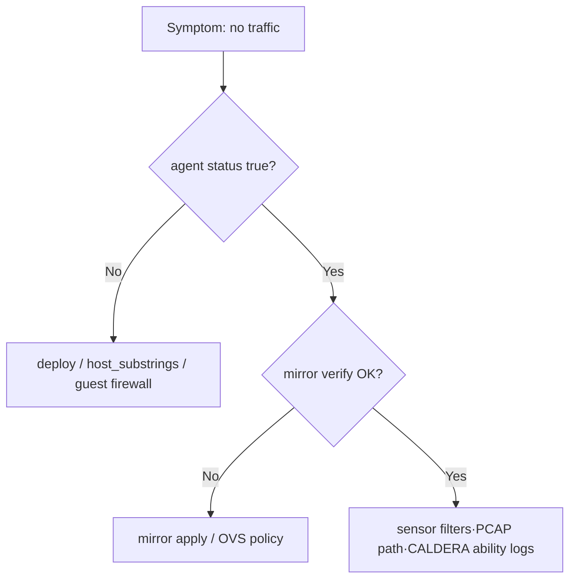

# CALDERA Integration — Operator Guide

> This runbook is for operators connecting to a MITRE CALDERA server to validate XDR Lab scenario orchestration end-to-end. With **no code changes**, only this document, `config/caldera-lab.json`, and scenario packs under `scenarios/` (or `config/scenarios/`), the lab should run end-to-end. Pack and JSON merge rules: see §4.4.
>
> Related components
> - Orchestration engine: `scripts/caldera_orchestration.py`
> - Configuration: `config/caldera-lab.json` (example: `config/caldera-lab.json.example`)
> - Scenario packs: `scenarios/*.json` (optional: `config/scenarios/`, `scenario_pack_dirs`)
> - Entry point: `aella_cli lab scenario …` → `xdr-lab-vm-manager.sh scenario …`
> - Runtime state: `runtime/state/scenario.json`, `runtime/state/caldera.json`
> - Structured logs: `logs/caldera-orchestration.jsonl`
> - Related specs: spec 008 (scenario framework), skill `attack-scenario-skill.md`

---

## 1. End-to-end flow summary

```
┌────────────────────────────────────────────────────────────────────┐
│  1) CALDERA server prep (docker / external instance / bootstrap)   │
│  2) Issue API key + configure XDR_CALDERA_API_KEY or api_key_file │
│  3) Edit config/caldera-lab.json and scenarios/ packs              │
│       - base_url (appliance/orchestrator REST)                     │
│       - agent_base_url (guest Sandcat callback URL)                │
│       - scenarios.<name>.adversary_id  (repo packs may stay null;  │
│         UUID fallback in config/caldera-lab.json — §4.4)           │
│     (optional) Atomic Red Team — see bootstrap/atomic-red-team-*    │
│  4) aella_cli lab scenario pack validate  ← pack schema·VM·telemetry│
│  5) aella_cli lab scenario list   ← reach CALDERA + merged list    │
│  6) aella_cli lab scenario bootstrap validate  ← CALDERA·API key│
│       plugins/atomic·ART paths·bootstrap scripts batch check       │
│  7) aella_cli lab scenario atomic validate  ← linux-server /       │
│       windows-victim guest ART paths·execution (SSH)               │
│  8) aella_cli lab scenario agent deploy --dry-run  ← VM/NAT/reach  │
│  9) aella_cli lab scenario agent deploy   ← bootstrap + Linux SSH │
│ 10) aella_cli lab scenario agent status   ← matrix·CALDERA summary │
│ 11) aella_cli lab scenario run <scenario> --snapshot-before        │
│ 12) aella_cli lab scenario status --human / telemetry / OVS mirror │
│ 13) aella_cli lab scenario stop                                     │
│ 14) (optional) aella_cli lab scenario agent remove                  │
└────────────────────────────────────────────────────────────────────┘
```

Prerequisites per step and where to look when something fails are covered in the sections below.

---

## 2. CALDERA server preparation

XDR Lab orchestration **does not start** the CALDERA process itself. Point `base_url` in `config/caldera-lab.json` at a CALDERA instance the appliance host can reach, and point `agent_base_url` at the address guest VMs can reach for Sandcat callbacks. In the standard br0 lab topology this is usually `base_url=http://127.0.0.1:8888` and `agent_base_url=http://10.10.10.1:8888`. To run CALDERA on the appliance host, you may use the optional bootstrap script `bootstrap/caldera-server-bootstrap.sh` (Ubuntu 24.04, systemd, API key file, bind address). Typical topologies:

### 2.0 CALDERA Server Bring-Up

This subsection is the **authoritative bring-up checklist** for a real CALDERA server that lab agents and `caldera_orchestration.py` will call. It complements §2.1–§2.3 and `bootstrap/caldera-server-bootstrap.sh` without changing any IP/port contracts enforced elsewhere in the repo.

#### Supported platform

| Item | Guidance |
| --- | --- |
| **Host OS** | **Ubuntu 24.04 LTS** (same generation as the XDR Lab appliance constitution). Other distros may work but package names, Node paths, and systemd units are **not** validated by this project’s bootstrap script. |
| **Python for CALDERA** | CALDERA runs from a **dedicated venv** under `${CALDERA_HOME:-/opt/caldera}/.venv` created by the bootstrap script (`python3 -m venv` + `pip install -r requirements.txt`). The host `python3` is whatever Ubuntu 24.04 ships (typically 3.12); **follow upstream CALDERA `requirements.txt`** for minimum Python if you deviate from Ubuntu 24.04. |
| **Node.js / npm** | Required for CALDERA UI build on first start (`server.py --build`). The bootstrap script installs `nodejs` and `npm` from Ubuntu repositories. |

#### Clone and install (operator sequence)

1. **Choose install root** — default `${CALDERA_HOME:-/opt/caldera}` and service user `caldera` (see `bootstrap/caldera-server-bootstrap.sh`).
2. **Recursive clone** — CALDERA depends on plugin submodules:

   ```bash
   git clone --recursive https://github.com/mitre/caldera.git /opt/caldera
   ```

   If you already cloned without `--recursive`, run `git submodule update --init --recursive` inside the repo before `pip install`.
3. **Create venv and install Python deps** (matches bootstrap behavior):

   ```bash
   cd /opt/caldera
   python3 -m venv .venv
   .venv/bin/pip install -U pip setuptools wheel
   .venv/bin/pip install -r requirements.txt
   ```

4. **Preflight without mutating the host** — from the appliance repo:

   ```bash
   ./bootstrap/caldera-server-bootstrap.sh --dry-run
   ```

5. **Install with bootstrap** (recommended for consistency):

   ```bash
   sudo CALDERA_LISTEN_HOST=127.0.0.1 CALDERA_PORT=8888 \
     ./bootstrap/caldera-server-bootstrap.sh
   ```

   For agents on the lab subnet only, bind to a lab-reachable address (example only — use your real plan): `CALDERA_LISTEN_HOST=10.10.10.1` and ensure host firewalls allow callbacks from victims.

#### Plugin enablement

Authoritative plugin list is **`conf/default.yml` → `plugins`** on the CALDERA server. XDR Lab’s `config/caldera-lab.json::plugins` is an **operator memo** only; the orchestrator does not push plugins to CALDERA.

Minimum set for stock adversaries, Sandcat, and Atomic-backed abilities used in most labs:

- **`sandcat`** — agent channel and downloads used by bootstrap one-liners.
- **`stockpile`** — default abilities and adversary content (CALDERA “Stockpile” plugin).
- **`atomic`** — bridges Atomic Red Team definitions into CALDERA abilities (when you want ART-aligned techniques inside operations).

Optional plugins (training, debrief, compass, etc.) depend on your exercise goals.

**Enable via `CALDERA_PLUGINS` (comma-separated, no spaces) when running the bootstrap script** so `default.yml` is rewritten atomically:

```bash
sudo CALDERA_PLUGINS=sandcat,stockpile,atomic \
  CALDERA_LISTEN_HOST=127.0.0.1 CALDERA_PORT=8888 \
  ./bootstrap/caldera-server-bootstrap.sh
```

If `CALDERA_PLUGINS` is empty, the script only **sed-patches** host, port, API key, and `app.contact.http`; it does **not** add missing plugins — edit `conf/default.yml` manually in that case.

#### Stockpile / Atomic / Sandcat verification

After the server process is up and the UI build finished:

| Check | How |
| --- | --- |
| **Stockpile** | CALDERA UI → **Plugins** (or equivalent) → confirm **stockpile** loaded; **Abilities** search should return stockpile-sourced techniques. |
| **atomic** | Same **Plugins** view → **atomic** enabled; **Abilities** filtered by `atomic` or T-code prefixes should return rows. If empty, confirm plugin directory under `plugins/atomic` and restart CALDERA. |
| **sandcat** | UI **Agents** page reachable; from a test host `curl -sI "$BASE/file/download/sandcat-linux"` (or platform-specific Sandcat path your CALDERA build exposes) should return HTTP headers (200/302/401 depending on build). |

Cross-check with **`aella_cli lab scenario bootstrap validate`** from the appliance after `base_url` and API key are configured — it performs HTTP + key + plugin/atomic presence checks **from the orchestration host’s perspective** (§5.1b).

#### API key configuration

1. CALDERA **`api_key_red`** in `conf/default.yml` must match what operators pass to XDR Lab (`XDR_CALDERA_API_KEY` or `api_key_file` in `config/caldera-lab.json`) — see §3.
2. The bootstrap script writes a random key to **`/etc/xdr-lab/caldera-api-key`** (mode `0600`) when the file is empty, and mirrors the value into `api_key_red`.
3. **Never commit** the live key; reference the file path in `caldera-lab.json` or export the variable in `config/lab.env`.

#### Server startup methods

| Method | When to use |
| --- | --- |
| **systemd** | Production-style lab hosts; bootstrap writes `caldera.service` and runs `systemctl enable --now` unless `CALDERA_SKIP_SYSTEMD=1`. |
| **Manual foreground** | Debugging UI build failures: `sudo -u caldera -H bash -lc 'cd /opt/caldera && .venv/bin/python3 server.py --insecure --build'` (paths per your install). |
| **Docker Compose** | Alternative topology; see §2.2. Compose is **not** shipped or started by XDR Lab. |

#### Recommended systemd unit (reference)

The bootstrap script emits a unit equivalent to:

```ini
[Unit]
Description=MITRE CALDERA (XDR Lab bootstrap)
After=network-online.target
Wants=network-online.target

[Service]
Type=simple
User=caldera
Group=caldera
WorkingDirectory=/opt/caldera
Environment=PYTHONUNBUFFERED=1
ExecStart=/opt/caldera/.venv/bin/python3 /opt/caldera/server.py --insecure --build
Restart=on-failure
RestartSec=5
LimitNOFILE=65535

[Install]
WantedBy=multi-user.target
```

Adjust `User`, `WorkingDirectory`, and `ExecStart` if `CALDERA_HOME` or the venv path differs.

#### Appliance-grade persistence (reboot-safe)

Golden Image or post-install repair should leave CALDERA in a state where **`caldera.service` starts without manual operator steps** after reboot. Use the bootstrap repair chain (not `xdr-lab.sh`, which remains an operational console only):

| Script | Role |
| --- | --- |
| `bootstrap/ensure-caldera-runtime.sh` | Idempotent venv + `requirements.txt` repair; resolves runtime user without hard-coding appliance accounts (`XDR_LAB_CALDERA_USER` overrides when set). |
| `bootstrap/repair-caldera-service.sh` | Reconciles `/etc/systemd/system/caldera.service` with `After=xdr-lab-host-network.service`, valid `User`/`Group`, and `ExecStart` pointing at `.venv/bin/python3`. Pass `--start` to start after repair; if unit/config are unchanged and CALDERA is already active, restart is skipped. |
| `bootstrap/validate-caldera.sh` | Read-only ordered checks (unit → user → ExecStart → `server.py` → active → port → HTTP). Use `--wait` after repair/restart so first-start `--build` grace is treated as startup, not a hard failure. |
| `bootstrap/ensure-caldera-api-key.sh` | Create/sync `/etc/xdr-lab/caldera-api-key` with `conf/default.yml` `api_key_red` (argon2). |
| `bootstrap/validate-appliance.sh` | One command: host-network + CALDERA + libvirt (+ optional mirror validator if present). |
| `bootstrap/deploy-caldera-runtime-fix.sh` | One-shot: install scripts under `/opt/xdr-lab/bootstrap`, run ensure + repair `--start` + validate. |

**Runtime user selection** (`ensure-caldera-runtime.sh` / `repair-caldera-service.sh`):

1. `XDR_LAB_CALDERA_USER` when that account exists.
2. Else `caldera` when present.
3. Else `User=` from existing `caldera.service` when valid.
4. Else `SUDO_USER` / `logname` fallback.

**Venv repair:** If `/opt/caldera/.venv/bin/python3` is missing, `ensure-caldera-runtime.sh` runs `python3 -m venv`. When `python3-venv` is not installed, the script fails with an actionable message; re-run as root with `--apt-repair` to install the package (bootstrap repair path only — not silent apt from validators).

**Validation order** (`validate-caldera.sh`):

1. `caldera.service` unit file exists  
2. unit enabled  
3. configured `User` exists  
4. `ExecStart` python binary exists and is executable  
5. `/opt/caldera/server.py` exists  
6. service `ActiveState` / `SubState` (decodes `ExecMainStatus` / `ExecMainCode`)  
7. `tcp/8888` (or configured port) listening — **no skip when `ss` is missing**  
8. HTTP `GET /api/agents` **reachable** (`http_local` — `200`/`302`/`401`/`403`, logs `http_code`, `location`, `content_type`)  
9. HTTP `GET /api/agents` **authenticated** (`http_api_authenticated` — `KEY:` header → `200` JSON; exit **35** on `302`→`/login` or missing key)  
10. Optional lab-gateway path when CALDERA is not loopback-bound (`http_via_gateway`)

`caldera_process` is **not** inferred from `pgrep`; it passes only when the service is active **and** the port is listening.

When `validate-caldera.sh --wait --timeout <seconds>` is used after
`repair-caldera-service.sh --start` or a manual restart, the validator first
polls CALDERA through the documented startup/build grace path. During this
window `http_code=000` and `tcp/8888 not listening` are treated as expected
startup signals while `server.py --build` has not bound the socket yet. If the
wait times out, the script still prints the normal ordered diagnostics and exits
with the CALDERA-not-ready class rather than misclassifying the race as a stale
or dead process.

**Common appliance failures**

| Symptom | systemd / probe signal | Fix |
| --- | --- | --- |
| `status=217/USER` | `ExecMainStatus=217` — `User=` account missing | `ensure-caldera-runtime.sh` + `repair-caldera-service.sh --start` |
| `status=203/EXEC` | `ExecMainStatus=203` — `.venv/bin/python3` missing | `ensure-caldera-runtime.sh` (venv repair) then `repair-caldera-service.sh --start` |
| Port **8888 not listening** immediately after repair/restart | `caldera_port_listen` would fail while `server.py --build` is still before bind | Run `validate-caldera.sh --wait --timeout 300`; first start may take minutes (`--build`) |
| Port **8888 not listening** after wait timeout | `caldera_port_listen` FAIL while unit auto-restarts or never binds | Fix venv/deps; `journalctl -u caldera.service` |
| HTTP probe failed | TCP up but `/api/agents` unreachable | Check `conf/default.yml` `host`/`port`, firewall, API process logs |

Deploy on a live appliance:

```bash
sudo /opt/xdr-lab/bootstrap/deploy-caldera-runtime-fix.sh
# or from repo checkout:
sudo ./bootstrap/deploy-caldera-runtime-fix.sh
```

#### Health verification

From the **same host that runs `aella_cli`** (or any host that must orchestrate CALDERA):

```bash
BASE="$(jq -r .base_url config/caldera-lab.json)"
KEY="$(tr -d '\n\r' < /etc/xdr-lab/caldera-api-key)"   # or export XDR_CALDERA_API_KEY
curl -s -o /dev/null -w "%{http_code}\n" -H "KEY: $KEY" "${BASE}/api/agents"
```

- **`200`** — key accepted; server healthy for REST.
- **`401` / `403`** — HTTP path works; key or role mismatch — fix `api_key_red` vs XDR Lab key source.
- **Connection refused / timeouts** — process down, wrong bind address, or firewall.

Then open the UI at `http://<host>:<port>/` and confirm red-operator login.

#### Common startup failures

| Symptom | Typical cause | Action |
| --- | --- | --- |
| systemd **start** loops or immediate crash | Missing venv deps, corrupt clone, port in use | `journalctl -u caldera.service -e`; verify `pip install -r requirements.txt`; `ss -lntp \| grep 8888`. |
| UI never loads / build hangs | Node/npm missing, low RAM, first `--build` | Ensure `nodejs`+`npm` installed; allow several minutes; watch foreground logs. |
| **`plugins` errors on boot** | Submodule not checked out | `git submodule update --init --recursive`. |
| **Agents cannot callback** | Bootstrap uses `127.0.0.1`, or CALDERA only listens on loopback from guest perspective | Bind to an address victims route to, or place a reverse proxy; align `agent_base_url` in `caldera-lab.json` with the guest-reachable URL. |
| **401 on every REST call** | Key drift between `default.yml` and XDR Lab | Reconcile `api_key_red` and `XDR_CALDERA_API_KEY` / `api_key_file`. |

#### Troubleshooting checklist (server bring-up)

1. OS is Ubuntu 24.04 (or you accept unsupported drift).
2. `git clone --recursive` (submodules present under `plugins/`).
3. Venv `pip install -r requirements.txt` completed without error.
4. `conf/default.yml` has correct `host`, `port`, `api_key_red`, `app.contact.http`, and `plugins` includes at least `sandcat`, `stockpile`, and (if needed) `atomic`.
5. `systemctl status caldera.service` **active (running)** or your chosen runtime equivalent.
6. `curl` to `/api/agents` with `KEY` returns **200** or meaningful **401** (not connection refused).
7. UI login works; **Plugins** page shows expected plugins green/loaded.
8. Only then run **`aella_cli lab scenario bootstrap validate`** from the appliance.

### 2.1 Recommended topologies

- **(A) Docker Compose on the appliance host** — simplest because `caldera_orchestration.py` uses HTTP only. Expose the service to the host and lab bridge, set `base_url` to `http://127.0.0.1:8888`, and set `agent_base_url` to the guest-reachable bridge address such as `http://10.10.10.1:8888`.
- **(B) Dedicated VM inside the lab (`test-vm1`, etc.)** — run the CALDERA container on a VM in lab subnet `10.10.10.0/24`. Set `base_url` like `http://10.10.10.40:8888`. Agents reach CALDERA directly without external NAT.
- **(C) External instance** — any host reachable from the lab subnet. You manage firewall and routing.

> Every topology must satisfy:
>
> 1. From the appliance host, `curl <base_url>/api/agents` returns **some** HTTP response (even auth failure).
> 2. From lab VMs (`windows-victim`, `victim-linux`, `sensor-vm`), `agent_base_url` is reachable over HTTP/HTTPS for Sandcat callbacks.

### 2.2 Quick docker compose example (reference only, unofficial)

> CALDERA is an external component not deployed or managed by XDR Lab.
> On an operator host it might look like:

```bash
# Example: on appliance host
git clone https://github.com/mitre/caldera --recursive
cd caldera
# Replace api_key_red / api_key_blue in conf/default.yml for your environment.
docker compose up -d
```

By default `http://<host>:8888` maps UI and REST together.

### 2.3 `bootstrap/caldera-server-bootstrap.sh` (Ubuntu 24.04, optional)

Install CALDERA as a **local systemd service** on the appliance or an admin VM (Ubuntu 24.04). The script:

| Step | Content |
| --- | --- |
| Packages | `python3`, `venv`, `pip`, `python3-yaml`, `git`, `curl`, `build-essential`, `nodejs`, `npm` |
| User | System user `caldera` (default), home `${CALDERA_HOME:-/opt/caldera}` |
| Source | `git clone --recursive https://github.com/mitre/caldera.git` |
| Dependencies | `pip install -r requirements.txt` in `${CALDERA_HOME}/.venv` |
| Config | `conf/default.yml` — `host`, `port`, `app.contact.http`, `api_key_red`, (optional) `plugins` |
| API key | Random hex key written to `/etc/xdr-lab/caldera-api-key` (0600), reflected in `api_key_red` |
| systemd | `/etc/systemd/system/caldera.service` → `python3 server.py --insecure --build` |

Bind address and port can be overridden with environment variables.

```bash
# Preflight (no file/package changes, root not required)
./bootstrap/caldera-server-bootstrap.sh --dry-run

# Install (e.g. localhost-only on lab host)
sudo CALDERA_LISTEN_HOST=127.0.0.1 CALDERA_PORT=8888 \
  ./bootstrap/caldera-server-bootstrap.sh

# For lab-internal IP so agents attach directly (firewall required)
# sudo CALDERA_LISTEN_HOST=10.10.10.1 CALDERA_PORT=8888 ./bootstrap/caldera-server-bootstrap.sh

# Shrink/change plugin list (comma-separated CALDERA plugin ids)
# sudo CALDERA_PLUGINS=sandcat,stockpile,atomic,access ./bootstrap/caldera-server-bootstrap.sh
```

Post-install checks:

```bash
systemctl status caldera.service --no-pager
sudo install -m 0600 /dev/null /etc/xdr-lab/caldera-api-key   # skip if already created
# caldera-lab.json: "api_key_file": "/etc/xdr-lab/caldera-api-key"
# or: export XDR_CALDERA_API_KEY="$(sudo cat /etc/xdr-lab/caldera-api-key)"
curl -s -o /dev/null -w "%{http_code}\n" -H "KEY: $(sudo cat /etc/xdr-lab/caldera-api-key)" \
  "http://127.0.0.1:8888/api/agents"
```

Treat `plugins`, `deployment.standalone_python`, and `atomic_red_team` in `config/caldera-lab.json.example` as audit/documentation notes; **authoritative** server configuration is always CALDERA `conf/default.yml` / UI.

### 2.4 Atomic Red Team (optional, separate from CALDERA)

ART is a **reference test suite**. The primary execution path for XDR Lab scenarios is CALDERA **operations** (`scenario run`). Having ART helps with custom abilities and manual validation.

| Target | Script | Notes |
| --- | --- | --- |
| Linux (`linux-server`, etc.) | `bootstrap/atomic-red-team-linux.sh` | `git clone` + safety readme; `--with-pwsh` adds `pwsh` + Gallery modules (optional) |
| Windows (`windows-victim`) | `bootstrap/atomic-red-team-windows.ps1` | Repo + (optional) `Install-Module invoke-atomicredteam`; **does not disable Defender**; SafeMode defaults to **no test execution** |

```bash
./bootstrap/atomic-red-team-linux.sh --dry-run
sudo ./bootstrap/atomic-red-team-linux.sh
# Verify path
test -d /opt/atomic-red-team/atomics && echo "ART atomics OK"
```

Windows (elevated PowerShell):

```powershell
Set-Location C:\path\to\xdr-lab-appliance\bootstrap
.\atomic-red-team-windows.ps1 -InstallModule   # when module install is needed
```

### 2.5 CALDERA environment validation (manual)

Use these checks when wiring a **new** CALDERA instance or after any server upgrade. They are **operator-run**; the orchestrator does not replace them.

#### Verify `/api/rest` manually

CALDERA exposes a JSON **index** API on `POST /api/rest` with header `KEY: <api_key>`.

```bash
BASE="$(jq -r .base_url config/caldera-lab.json)"
curl -s -X POST -H "KEY: $XDR_CALDERA_API_KEY" -H "Content-Type: application/json" \
  -d '{"index":"abilities"}' "${BASE}/api/rest" | head -c 400
```

- A JSON array or object response (not HTML login page) indicates the REST surface is alive.
- **`401`/`403` on GET/POST** with a JSON body often still proves TLS/HTTP routing is correct — fix the key next.

If your deployment uses CALDERA **v2-style** endpoints (e.g. `/api/v2/agents`), those are also valid health probes — see below.

#### Verify the API key manually

```bash
curl -s -o /dev/null -w "%{http_code}\n" -H "KEY: $XDR_CALDERA_API_KEY" \
  "$(jq -r .base_url config/caldera-lab.json)/api/agents"
```

| HTTP code | Meaning |
| --- | --- |
| **200** | Key accepted. |
| **401** | Server reachable; key or operator role mismatch — align `api_key_red` with `XDR_CALDERA_API_KEY` / `api_key_file` (§3). |
| **000** / connection errors | Wrong `base_url`, service down, or firewall. |

#### Verify plugins

1. **UI** — logged in as red operator → **Plugins** (or your build’s equivalent) → confirm `sandcat`, `stockpile`, and (if required) `atomic` show as enabled/loaded.
2. **Filesystem** (on CALDERA host) — `plugins/sandcat`, `plugins/stockpile`, `plugins/atomic` directories exist and are populated (submodules).
3. **Appliance-side batch hint** — `aella_cli lab scenario bootstrap validate` records plugin-related checks against `caldera-lab.json` and HTTP probes (§5.1b); it does not SSH into the CALDERA host to read `conf/default.yml`.

#### Verify agent check-in

```bash
curl -s -H "KEY: $XDR_CALDERA_API_KEY" \
  "$(jq -r .base_url config/caldera-lab.json)/api/v2/agents" | jq '.[] | {paw, host, platform, last_seen}'
```

Compare with **`aella_cli lab scenario agent status`** matrix (§5.5–§5.6). Fresh `last_seen` timestamps indicate Sandcat beacons are reaching `app.contact.http`.

#### Verify adversary UUIDs

```bash
curl -s -X POST -H "KEY: $XDR_CALDERA_API_KEY" -H "Content-Type: application/json" \
  -d '{"index":"adversaries"}' "$(jq -r .base_url config/caldera-lab.json)/api/rest" \
  | jq '.[] | {adversary_id, name}'
```

Each `adversary_id` must be a **canonical UUID string** (lowercase hex and hyphens, 36 chars) matching what you paste into `config/caldera-lab.json::scenarios.<id>.adversary_id` or pack `caldera.adversary_id` (§4).

#### Verify planner names

Built-in planner ids commonly include **`atomic`**, **`batch`**, and **`sequential`** (exact set depends on CALDERA version and enabled plugins).

- **UI** — when starting or inspecting an **Operation**, the planner dropdown lists valid planners for that server build.
- **Config alignment** — scenario packs require a `caldera.planner` string; `caldera-lab.json` supplies `default_planner` when packs omit it. After picking a planner in the UI, copy the **exact id string** into your pack or JSON so `scenario run` payloads match server capabilities.

If a planner string does not exist on the server, CALDERA may reject the operation at runtime — prefer names visible in the UI for your version.

---

## 3. API key configuration (credentials location)

| Source | Path / variable | Notes |
| --- | --- | --- |
| **Environment (recommended)** | `XDR_CALDERA_API_KEY` | Highest priority; load via `config/lab.env` on the appliance |
| **Config file** | `config/caldera-lab.json` → `api_key_file` | Absolute path to a single-line key (mode `0600`) |
| **Alternate env name** | `caldera-lab.json` → `api_key_env` | Used when `XDR_CALDERA_API_KEY` is unset |
| **Bootstrap default** | `/etc/xdr-lab/caldera-api-key` | Created by `bootstrap/caldera-server-bootstrap.sh` or **`bootstrap/ensure-caldera-api-key.sh`** (mode `0600`, root-only) |
| **Auto-sync helper** | `bootstrap/ensure-caldera-api-key.sh` | Generates or rotates key when missing; hashes `api_key_red` in `conf/default.yml` (argon2) |
| **Optional session cookie** | `XDR_CALDERA_SESSION_COOKIE` or `session_cookie_file` | UI cookie only; REST still expects `KEY` for `/api/*` |

`validate-caldera.sh` and `scenario list` distinguish **HTTP reachable** (any response including `302` → `/login`) from **API authenticated** (`GET /api/agents` with `KEY:` returns `200` JSON). JSONL `caldera_agents_fetch_failed` uses `error=auth_required` (not `json_decode_error`) when the server redirects to login or returns an HTML login page.

`caldera_orchestration.py` resolves the API key in this order (`scripts/caldera_orchestration.py::resolve_api_key`):

1. If `XDR_CALDERA_API_KEY` is non-empty, use it.
2. If `api_key_file` in `config/caldera-lab.json` points to a readable file, use its stripped contents.
3. Otherwise the environment variable named by `api_key_env` (default `XDR_CALDERA_API_KEY`).

Recommended patterns:

### 3.1 One-shot appliance setup (recommended)

When `/etc/xdr-lab/caldera-api-key` is missing but CALDERA is installed under `/opt/caldera`:

```bash
sudo ./bootstrap/ensure-caldera-api-key.sh
```

The script:

1. Probes `GET /api/agents` with the `KEY` header (no redirect follow).
2. If the key file is missing and `api_key_red` in `conf/default.yml` is **argon2-hashed** (normal CALDERA 5.x), generates a **new** plaintext key, writes `/etc/xdr-lab/caldera-api-key`, updates the hash in `default.yml`, and restarts `caldera.service` when active.
3. Sets `config/caldera-lab.json` → `api_key_file` to `/etc/xdr-lab/caldera-api-key` (repo default).

`xdr-lab-vm-manager.sh scenario …` exports `XDR_CALDERA_API_KEY` from that file automatically when readable (or via passwordless `sudo` + ensure).

**Verify authentication:**

```bash
export XDR_CALDERA_API_KEY="$(sudo tr -d '\n\r' < /etc/xdr-lab/caldera-api-key)"
curl -s -o /dev/null -w "%{http_code}\n" \
  -H "KEY: $XDR_CALDERA_API_KEY" \
  "$(jq -r .base_url config/caldera-lab.json)/api/agents"
# Expect: 200

sudo ./bootstrap/validate-caldera.sh
# Expect: http_local PASS, http_api_authenticated PASS
```

### 3.2 Environment variable (optional override)

```bash
export XDR_CALDERA_API_KEY="$(sudo tr -d '\n\r' < /etc/xdr-lab/caldera-api-key)"
aella_cli lab scenario list
```

The variable propagates `aella_cli` → bash dispatcher → `python3 caldera_orchestration.py`. Because it is per-shell, consider adding it to `config/lab.env` and loading with `set -a; . config/lab.env; set +a`.

### 3.3 File-backed key (multi-operator)

```bash
sudo install -m 0600 -o root -g aella /dev/null /etc/xdr-lab/caldera.key
echo 'ADMIN123' | sudo tee /etc/xdr-lab/caldera.key
# config/caldera-lab.json:
#   "api_key_file": "/etc/xdr-lab/caldera.key"
```

### 3.4 Alternate environment variable name

If another ops tool already owns `XDR_CALDERA_API_KEY`, set `api_key_env`:

```json
{
  "api_key_env": "CALDERA_RED_KEY"
}
```

Then the alternate variable is used per step 3 above (but an explicitly set `XDR_CALDERA_API_KEY` still wins at step 1).

### 3.5 HTTP usage

Every request adds (`scripts/caldera_orchestration.py::CalderaClient.request_json`):

```
KEY: <api_key>
Accept: application/json
Content-Type: application/json   # PUT/POST only
```

CALDERA `/api/rest` and `/api/<index>` (e.g. `/api/agents`) use the same `KEY` header.

---

## 4. How to find adversary_id

`scenarios.<name>.adversary_id` or the scenario pack field `caldera.adversary_id` under the **same name** is the CALDERA Adversary Profile id (UUID). If empty, `aella_cli lab scenario run <name>` **does not create an operation** and fails immediately (`status=blocked`, `last_error="… has no adversary_id"`).

### 4.0 Live gate: `missing_adversary_id`

When preflight or `cmd_run` detects no merged UUID for the requested `scenario_id`, JSONL records include **`code": "missing_adversary_id"`** (and related stderr). This is **not** a network failure — the orchestrator refuses to `PUT` an operation without a real CALDERA adversary profile id.

**Fix (always one of):**

1. Set **`config/caldera-lab.json::scenarios.<scenario_id>.adversary_id`** to a valid UUID (recommended when repo packs keep `null`), **or**
2. Set **`caldera.adversary_id`** inside the scenario pack JSON for that `scenario_id` (pack wins over JSON when non-empty — §4.4c).

**Validate before a live run:**

```bash
aella_cli lab scenario list
# Confirm the row for your scenario_id shows a non-empty adversary_id column (merged value).
aella_cli lab scenario run <scenario_id> --snapshot-before --dry-run
# Dry-run uses placeholder UUID for CALDERA PUT but still validates pack/adversary wiring on stdout.
```

If `scenario list` shows an empty `adversary_id` for your scenario, non-dry `scenario run` will hit `missing_adversary_id` until you map a UUID (steps below).

### 4.0a Adversary UUID workflow (end-to-end)

| Step | Action |
| --- | --- |
| 1. Create or pick a profile | CALDERA UI **Adversaries** (§4.1) or clone/compose a profile from **Stockpile**-supplied templates (§4.0b). |
| 2. Capture UUID | Browser URL `…/#/adversaries/<uuid>` or REST `POST /api/rest` `{"index":"adversaries"}` (§4.2). |
| 3. Map to scenario pack | For each `scenario_id` (`recon`, `web`, …), store UUID in **`caldera-lab.json`** fallback **or** pack `caldera.adversary_id` (§4.4c). Maintain a private **scenario_id → UUID** table for your team. |
| 4. Validate merge | `aella_cli lab scenario list` — merged `adversary_id` and `source` columns must show the intended UUID (not blank). |
| 5. Dry-run gate | `aella_cli lab scenario run <scenario_id> --snapshot-before --dry-run` — read stdout preflight block; fix warnings that matter for your lab policy. |
| 6. Live | Remove `--dry-run` only after step 4 shows a real UUID. |

**Expected UUID format:** lowercase **RFC 4122** string with hyphens, 36 characters, e.g. `0f4c3c67-845e-49a0-927e-90ed33c044e0`. CALDERA may display uppercase in the UI — normalize to lowercase in JSON if your tooling is case-sensitive.

**API example (list adversaries):**

```bash
aella_cli lab caldera adversaries list

BASE="$(jq -r .base_url config/caldera-lab.json)"
curl -s -X POST -H "KEY: $XDR_CALDERA_API_KEY" -H "Content-Type: application/json" \
  -d '{"index":"adversaries"}' "${BASE}/api/rest" | jq '.[] | {adversary_id, name}'
```

**API example (create adversary — illustrative; payload shape varies by CALDERA version — prefer UI or official CALDERA docs for your tag):**

```bash
# Replace <PAYLOAD> with a version-correct JSON body from CALDERA API docs / UI network capture.
curl -s -X PUT -H "KEY: $XDR_CALDERA_API_KEY" -H "Content-Type: application/json" \
  -d '<PAYLOAD>' "${BASE}/api/rest"
```

Always confirm the created id via `{"index":"adversaries"}` or the UI URL before wiring XDR Lab.

### 4.0b Stockpile UI flow (abilities and adversary content)

**Stockpile** is a CALDERA **plugin** that ships many default **abilities** and **adversary profiles**. Operators often build lab-safe profiles from Stockpile building blocks:

1. Enable **stockpile** (and **atomic** if you need ART-mapped techniques) in `conf/default.yml` → `plugins` (§2.0).
2. Restart CALDERA; confirm **Plugins → stockpile** loaded without errors (`journalctl` / container logs).
3. Open **Abilities** (or your build’s ability browser) — filter by source/plugin **stockpile** to see candidate techniques.
4. Open **Adversaries** → **Create** (or duplicate an existing Stockpile-backed profile such as **Discovery**).
5. **Add abilities** — search Stockpile / Atomic ids; add a **small** set aligned with your scenario pack `expected_telemetry` (§4.1c).
6. **Save** — copy the profile UUID from the URL bar.
7. Paste UUID into **`caldera-lab.json::scenarios.<scenario_id>.adversary_id`** (fallback) or the pack’s `caldera.adversary_id`.
8. Run **`aella_cli lab scenario list`** then **`scenario run <scenario_id> --snapshot-before --dry-run`** to validate wiring.

> Duplicating a built-in adversary and **trimming** abilities is usually safer than running full vendor bundles unchanged in a small lab.

### 4.1 CALDERA UI — create/select adversary and read UUID

Labels vary by build; the flow is the same: open **Adversaries**, pick or create a profile, copy the UUID from the browser URL.

#### 4.1a Read UUID for an existing profile

1. Browse to `http://<base_url>/` (or your deployed UI path) and sign in as **red operator**.
2. Navigate **Campaigns** (or near **Plugins**) → **Adversaries**.
3. Click the profile you will run. The URL becomes `…/#/adversaries/<adversary_id>` — copy the **full trailing UUID** (hyphens, no spaces).
4. Paste into `config/caldera-lab.json::scenarios.<scenario_id>.adversary_id` (or keep repo packs `null` per §4.4c).

#### 4.1b Create a new adversary profile in the UI (Atomic plugin example)

1. On **Adversaries**, use **Create** / **+** / **New profile**. Pick a lab-friendly name (e.g. `xdr-lab-recon-art`).
2. Open **Abilities** / **Add abilities**, search **atomic** abilities and add them. If atomic does not load, align CALDERA server `plugins` first — §2.3, `scenario bootstrap validate`.
3. **Save**, reopen the profile, confirm UUID in the URL.
4. Keep a private note mapping `scenario_id` ↔ `adversary_id` for correlation with `scenario list` ids (`recon`, `web`, …).

> **Note**: Bundled adversaries (e.g. Discovery) already bundle abilities. In labs it is often safer to **Duplicate** and trim abilities (menu names vary by version).

### 4.1c ART-oriented ability / adversary layout (example)

XDR Lab **does not invoke ART directly**; the primary path is CALDERA **operations**. The **atomic** plugin exposes ART definitions as abilities, so “ART-based” profiles are usually assembled inside CALDERA.

| Goal | Composition idea | Notes |
| --- | --- | --- |
| Align with `recon` pack | Duplicate Discovery-style defaults, or bundle inventory/DNS-style atomic abilities | Eyeball against pack `expected_telemetry` |
| `web` | HTTP client / web-request-like abilities (search atomic/stockpile) | Restrict outbound URLs to lab policy |
| `c2` | Abilities that simulate beacon/callback patterns | No real external C2 — lab hosts only |
| `lateral` | SMB/RDP/remote execution scoped to **target VMs** | Review with `target_vms` and firewalls |
| `exfil` | Staging / small-transfer simulation abilities | No bulk or sensitive data |

Concrete ability ids vary by CALDERA version and plugins — filter in UI with `atomic` / `T1xxx`, add **few** abilities, and inspect payloads with `scenario run <id> --dry-run`.

### 4.2 REST bulk lookup (recommended for scripting)

Use CALDERA `/api/v2/adversaries` (v4.x+) or `/api/rest` index `adversaries`.

```bash
# v2 API (CALDERA v4.x+)
curl -s -H "KEY: $XDR_CALDERA_API_KEY" \
     "http://<base_url>/api/v2/adversaries" \
  | jq '.[] | {id: .adversary_id, name: .name}'

# Or /api/rest (broader version compatibility)
curl -s -X POST -H "KEY: $XDR_CALDERA_API_KEY" \
     -H "Content-Type: application/json" \
     -d '{"index":"adversaries"}' \
     "http://<base_url>/api/rest" \
  | jq '.[] | {id: .adversary_id, name: .name}'
```

Example response:

```json
[
  {"id": "0f4c3c67-845e-49a0-927e-90ed33c044e0", "name": "Discovery"},
  {"id": "5d3e170e-f1b8-49f9-b3df-32ff97f4ed4b", "name": "Hunter"}
]
```

Pick the `id` whose intent matches your lab scenario and store it per §4.4c.

### 4.3 Per-scenario mapping guide

You invoke `scenario run <NAME>` per **scenario_id** from `scenario list`. Default packs under `scenarios/*.json` typically include:

| scenario_id | Intent | Suggested CALDERA adversary (examples) |
| ----------- | ------ | -------------------------------------- |
| `recon`     | ping/nslookup/curl/scan-style recon | `Discovery` |
| `web`       | HTTP / webshell-like patterns | `Hunter` or custom |
| `c2`        | Callback / command-channel patterns | Environment-specific C2/actor profile |
| `lateral`   | SMB / PsExec / RDP lateral movement | `Worm` / `Mover` |
| `exfil`     | staged upload/download | `Thief` / `Collection` |

The `c2` scenario exists in packs but is **not** rigidly tied to a default CALDERA profile name. The table is a **starting point**; resolve actual `name` → UUID via §4.2.

Legacy-only names (`web-test`, `lateral-movement`, `exfiltration`) may appear from `caldera-lab.json::scenarios` alone (`source=config:caldera-lab.json::scenarios.<name>`).

> Default CALDERA adversary names change across versions. Maintain your environment’s `name` → `adversary_id` map in **pack `caldera.adversary_id`** or the `caldera-lab.json` fallback.

### 4.4 Scenario pack structure (`scenarios/`, `config/scenarios/`)

- **Search order**: read `<XDR_ROOT>/scenarios/` first, then `<XDR_ROOT>/config/scenarios/`. Extensions `.json`, `.yaml`, `.yml` only; ignore filenames starting with `.` or `_`.
- **Extra dirs**: `scenario_pack_dirs` in `caldera-lab.json` (array of paths, absolute or home-relative) appends after those two.
- **Pack root fields** — each file describes one scenario:

| Field | Type | Description |
| --- | --- | --- |
| `scenario_id` | string | Identifier used with `scenario run` (unique). |
| `display_name` | string | Short title in listings. |
| `description` | string | One or more lines of description. |
| `target_vms` | string[] | VMs recorded in CALDERA operation metadata. Empty array means runtime resolves to the role list from `caldera-lab.json::agents` (`agent_vm_roles`). |
| `caldera` | object | `adversary_id` (UUID or null), `group`, `planner`. |
| `expected_telemetry` | string[] or string | **Required.** Operator / NDR correlation hints (orchestrator does **not** auto-validate; §4.5). |
| `safety_notes` | string | Safety / ethics notes. |
| `cleanup_notes` | string | Teardown / recovery notes. |

- **YAML**: `.yaml`/`.yml` loads only when **PyYAML** is installed. Use `.json` packs for dependency-free operation.
- **Broken packs**: `scenario list` logs one stderr `[warn]` line and skips the file. With `XDR_LAB_SCENARIO_PACK_STRICT=1`, listing **fails immediately (exit 1)**.
- **Merge / fallback** (`build_scenario_registry`):
  1. **Pack wins** on same `scenario_id`.
  2. **`caldera-lab.json` enrichment**: if the same key exists under `scenarios`, fill **only when** pack `caldera.adversary_id` is empty — supply `adversary_id` and empty `description` from JSON (never overwrite non-empty pack fields).
  3. **Legacy-only keys**: entries like `web-test` with **no pack** register from `scenarios` alone; `target_vms` falls back to runtime role list.

Example (legacy fallback only — still valid):

```json
"scenarios": {
  "recon": {
    "adversary_id": "0f4c3c67-845e-49a0-927e-90ed33c044e0",
    "description": "ping / nslookup / curl / scan (CALDERA adversary: Discovery)"
  }
}
```

If the same key `recon` exists in **both** pack and JSON, the JSON `adversary_id` applies **only when** pack `caldera.adversary_id` is empty.

When `caldera.adversary_id` is **null**, `expected_telemetry` may still be present but `pack validate` emits a **warning**, and non-dry `scenario run` stays **blocked** until a UUID is supplied (`scenario pack validate` table and `runtime/state/scenario.json` `last_error`). Create the adversary in CALDERA UI/REST, then register the UUID per §4.4c below.

#### 4.4c Repo packs keep `adversary_id: null` — where operators fill UUIDs

Committed `scenarios/*.json` may keep **`caldera.adversary_id` `null`** to avoid publishing CALDERA UUIDs or to vary adversaries per environment. At **runtime**, values merge (`build_scenario_registry`) with this precedence:

| Priority | Location | Meaning |
| --- | --- | --- |
| 1 (authoritative) | Pack `caldera.adversary_id` | If set, this UUID is always used |
| 2 (fallback) | `config/caldera-lab.json::scenarios.<scenario_id>.adversary_id` | Used only when pack is null/empty |
| 3 | Both empty | `pack validate` **warning**; non-dry `scenario run` **blocked** |

Recommended ops: **keep packs `null`**, store UUIDs in a team-shared `caldera-lab.json` (or split secrets via `config/lab.env`). Copying packs locally with embedded UUIDs works but risks accidental commits — **JSON fallback** is the documented default.

### 4.5 `scenario pack validate` (static preflight)

Unlike `scenario list`, which may skip broken packs with warnings, **`pack validate`** inspects **pack files only**: JSON/YAML parse, required fields, and consistency with VM roles in `config/lab-vms.json` (`caldera-lab.json::scenarios` legacy entries are **not** validated).

```bash
aella_cli lab scenario pack validate
aella_cli lab scenario pack validate --json   # JSON report on stdout only
# Equivalent: bash scripts/xdr-lab-vm-manager.sh scenario pack validate [--json]
```

**Check summary**

| Case | Outcome |
| --- | --- |
| JSON/YAML parse failure | **error** — file, line/col when possible, message in report |
| Cannot read `config/lab-vms.json` | **fatal** (exit 2) — cannot validate `target_vms` |
| Missing required fields, type errors, empty strings | **error** (`scenario_id`, `display_name`, `description`, `target_vms`, `caldera.group`, `caldera.planner`, `expected_telemetry`, `safety_notes`, `cleanup_notes`, `caldera` object) |
| Each `target_vms` entry missing from `lab-vms.json::vms` | **error** |
| `target_vms` is empty array | **error** (`pack validate` only — runtime `scenario run` may interpret empty array as role list; §4.4 table) |
| `caldera.adversary_id` missing, null, or empty | **warning** — fill UUID from CALDERA UI/REST before execution |
| Duplicate `scenario_id` across pack files | **error** (lists every conflicting file) |

#### 4.5a Clearing the `adversary_id` warning

This is **not an error** (exit code stays 0 when no errors). Meaning:

- Validation inspects pack files only; **`caldera-lab.json` fallback UUID does not remove** the warning while pack still shows `null`.
- To eliminate warning lines you can either:
  1. Put the UUID directly in the **pack** `caldera.adversary_id` (may conflict with repo policy), or
  2. Treat the warning as expected and confirm executability via `scenario list` merged columns (`adversary_id`, `source`) and `scenario run … --dry-run`.

To avoid execution **blocked** status, the merged UUID must be non-empty — if the pack is `null`, fill §4.4c **JSON fallback**.

Other pack validate messages follow report `code` / `message`. Typical fixes: `target_vms` errors → use roles from `lab-vms.json`, remove empty arrays; duplicate `scenario_id` → delete or rename file; parse errors → fix JSON/YAML syntax.

**`expected_telemetry` (documentation contract)**

- Key is required; value must be either (1) a single non-empty **string**, or (2) a **non-empty array** whose elements are non-empty strings.
- The orchestrator **does not** automatically correlate this field with sensors today (planned `scenario verify`; §14). Operators manually correlate using `scenario status`, mirror captures, and sensor UI.

**Exit codes**

- **0**: no errors (warnings allowed)
- **1**: one or more pack **errors**
- **2**: `lab-vms.json` **fatal** (read/parse failure)

---

## 5. Agent (Sandcat) deployment flow

`caldera_orchestration.py` does not ship Sandcat binaries. `agent deploy` **generates bootstrap scripts** reflecting `caldera-lab.json::agent_base_url`, SSHs from the appliance into Linux-class VMs, and runs the script **remotely on stdin** (constitution P-9 — no apt install side effects on our side). Windows may auto-run via SSH or require manual PowerShell depending on path. Do not set `agent_base_url` to `127.0.0.1` unless CALDERA is running inside the guest itself.

Target VMs come from `config/caldera-lab.json::agents` (`enabled`, `bootstrap`: `linux` | `windows`, `ssh_user`, etc.). See `config/caldera-lab.json.example` `_help_agents`.

### 5.1 Preflight (shared by deploy / status)

Before deployment the tooling verifies or reflects:

| Check | Operator action |
| --- | --- |
| Target VMs **running** (libvirt) | `aella_cli lab start <vm>` etc. |
| **Reverse NAT** (`runtime/state/nat.json`) | On host: `aella_cli lab nat verify` (or `nat status`) for Golden Image DNAT contract vs iptables |
| CALDERA `base_url` + **API key** | §2·§3, confirm appliance reachability with `scenario list` |
| CALDERA `agent_base_url` | Guest-reachable Sandcat callback URL, typically `http://10.10.10.1:8888` on the standard lab bridge |
| **SSH / WinRM / RDP** reachability | Linux via SSH batch probes; Windows uses inventory such as `external_nat_port_mapping` in `config/lab-vms.json` for SSH / WinRM HTTPS / RDP TCP (ports exactly as defined in Golden Image / `lab-vms.json`; do not invent new contracts here) |

### 5.1b `scenario bootstrap validate` (CALDERA + Atomic preflight)

Before scenarios run, one command checks CALDERA HTTP reachability, API key, `caldera-lab.json` `plugins` snapshot, **atomic plugin presence**, `atomic_red_team` Linux/Windows path strings, and that repo scripts `bootstrap/atomic-red-team-linux.sh` and `bootstrap/atomic-red-team-windows.ps1` exist. On failure stdout prints a **remediation** block and exit **1**. Success exits **0**.

```bash
aella_cli lab scenario bootstrap validate
aella_cli lab scenario bootstrap validate --json   # JSON report on stdout only
```

`--json` includes `checks`, `remediation_hints`, `ok`.  
`runtime/state/caldera.json::server_bootstrap` updates `bootstrap_install_status`, `bootstrap_install_detail`, `last_bootstrap_validate_utc`, `bootstrap_validate_checks`.

Recommended order right before `scenario run`: **bootstrap validate** → **atomic validate** → **agent deploy --dry-run** → **agent deploy** → **run --snapshot-before** (§6.0–6.1).

### 5.1c `scenario atomic validate` (guest ART / execution-based)

For `linux-server` and `windows-victim`, verify via **appliance→VM SSH** (Windows follows the same **SSH-first** remote checks as `agent deploy`):

| Check | linux-server | windows-victim |
| --- | --- | --- |
| libvirt **running** | yes | yes |
| **VM reachability** | SSH (`probe_ssh_linux_vm`) | At least one of SSH·WinRM·RDP (`probe_windows_access`); remote file checks **require SSH** |
| **Guest ART repo path** | `caldera-lab.json::atomic_red_team.linux_repo_path` | `windows_repo_path` |
| **`atomics/`** and YAML sample | yes | atomics/ (YAML sample strictness on Linux only) |
| **Linux execution** | `bash` + `python3` | n/a |
| **PowerShell / Invoke-AtomicRedTeam** | If `pwsh` exists, module + `Invoke-AtomicTest` required; otherwise alternate pass path | Module + `Invoke-AtomicTest` **required** |
| **Appliance bootstrap scripts** | `bootstrap/atomic-red-team-linux.sh` / `.ps1` exist | same |

Failure prints **remediation** and exits **1**. Success exits **0**.

```bash
aella_cli lab scenario atomic validate
aella_cli lab scenario atomic validate --json   # JSON on stdout (stderr may duplicate JSONL)
```

`runtime/state/caldera.json::atomic_red_team_validate_last` records `utc`, `ok`, `summary`, per-VM `checks`/`remote`, `remediation_hints`, `atomic_red_team_paths` snapshot.

**Limitation**: Without SSH on Windows, WinRM/RDP alone does not auto-inspect guest paths; remediation reports `windows-victim:ssh_required`.

### 5.2 `agent deploy` and `--dry-run`

```bash
# Real deploy: generate bootstrap + (when eligible) Linux/Windows SSH remote run
aella_cli lab scenario agent deploy

# Preflight: VM state·NAT·SSH/WinRM/RDP probe·CALDERA HTTP probe;
#            skip remote bootstrap execution only. Bootstrap files still generated.
aella_cli lab scenario agent deploy --dry-run
```

Also callable as `bash scripts/xdr-lab-vm-manager.sh scenario agent deploy …`
or with `XDR_LAB_DRY_RUN=1`, which may route deploy through the dry path (`scripts/caldera_orchestration.py::deploy_effective_dry`).

An empty API key is **preflight fatal** for non-dry-run deploy (immediate exit **2**). **Dry-run** warns but continues VM/NAT checks and bootstrap file generation.

**`scenario agent deploy` exit policy** (`caldera_orchestration.py::cmd_agent_deploy`):

| Mode | exit | Meaning |
| --- | ---: | --- |
| `--dry-run` or `deploy_effective_dry` | **0** | Process always exits 0 (diagnostics/CI). `agent_deploy_last.exit_code` is **0**, `fatal_preflight` **false**. |
| Non-dry, preflight fatal | **2** | Missing CALDERA **API key** or appliance **CALDERA HTTP probe failure** (server down, bad `base_url`, network block). |
| Non-dry, partial failure after preflight | **1** | NAT mismatch, VM down, SSH failure, remote bootstrap failure, CALDERA unreachable causing **remote skip**, Windows **manual** path, other VM-step failures. |
| Non-dry, full success | **0** | All target VMs succeeded on expected automatic paths. |

Even in dry-run, CALDERA unreachable, NAT warnings, stopped VMs appear on stderr, `remediation_hints`, and JSONL `caldera_agent_deploy_finished`.

**`runtime/state/caldera.json::agent_deploy_last`**: updated each deploy. Key fields: `dry_run`, `exit_code` (same semantics as table), `fatal_preflight`, `fatal_reason` (e.g. `api_key_missing`, `caldera_unreachable`), `per_vm` per-VM `status`/`detail` (legacy `vms` key mirrors content), `remediation_hints` (structured hints array).

**`runtime/state/caldera.json::server_bootstrap`**: snapshot of `plugins`·`atomic_red_team` from `caldera-lab.json`. After `scenario bootstrap validate`, `bootstrap_install_status` becomes `ok` or `failed`, with `last_bootstrap_validate_utc`·`bootstrap_validate_checks` metadata. Later `scenario list` etc. calling `refresh_state` keeps validation fields but **re-overwrites** `plugins`/`atomic_red_team` from config. **Whether CALDERA is actually installed on the server host** (systemd/docker) still requires host-level checks (see placeholder strings).

1. From the appliance (host), SSH attempts target VMs per `lab-vms.json`/libvirt (`ssh_batch_cmd`, stdin delivery of `bootstrap-linux.sh`).
2. On success the guest runs the Sandcat one-liner (`curl` + `python3`/`sh`) and agents register with CALDERA **asynchronously**.

`bootstrap-linux.sh` is always refreshed under `${XDR_ROOT}/runtime/caldera-agent/`. Re-run deploy after changing `agent_base_url`.

### 5.4 Windows VM (`bootstrap: windows`)

`probe_windows_access` picks transport from inventory and NAT mappings.

- **SSH** (external NAT SSH port or internal IP + `BatchMode` SSH) open **and** user set (`agents.<vm>.ssh_user`, `XDR_LAB_WINDOWS_SSH_USER`, or `lab-vms.json::ssh_user`): appliance runs `powershell.exe -Command -` with `bootstrap-windows.ps1` on stdin — **automatic**.
- **WinRM HTTPS** or **RDP only**: **no credential-less WinRM remote execution.** Operator runs `${XDR_ROOT}/runtime/caldera-agent/bootstrap-windows.ps1` from elevated PowerShell, or copies/runs via WinRM (PSSession). RDP-only: use share/paste deployment.

### 5.5 `agent status` and `--json`

```bash
# Human summary: CALDERA URL·HTTP reachability·API key presence·role connectivity·
# last deploy summary (agent_deploy_last) — after scenario/caldera state refresh
aella_cli lab scenario agent status

# Role true/false matrix only as one JSON blob (automation/dashboards)
aella_cli lab scenario agent status --json
```

Default `status` runs `refresh_state` on `runtime/state/scenario.json` and `runtime/state/caldera.json`, then prints a summary.

`status --json` prints **only** the refreshed `scenario.json` `agents` object to stdout (role name → match vs CALDERA `/api/agents` and `agent_vm_map.host_substrings`).

### 5.6 `agent_vm_map` and the matrix

`/api/agents` responses are matched case-insensitively against `config/caldera-lab.json::agent_vm_map.<vm>.host_substrings` using the concatenation of `paw`, `host`, `display_name`, `platform`, `group`, `contact`.

If nothing matches:

- Agent host/platform strings missing from `host_substrings` → add real hostname patterns to `caldera-lab.json`.

  ```json
  "agent_vm_map": {
    "windows-victim": {
      "host_substrings": ["windows", "victim", "win-victim", "win10", "DESKTOP-"]
    }
  }
  ```

- No agents in CALDERA → check bootstrap, networking, §10.1.

### 5.7 Remediation by symptom (deploy / status output)

| Symptom | Action |
| --- | --- |
| VM not running | `start` the VM, re-run `agent deploy` |
| Reverse NAT mismatch / `nat.json` warning | `aella_cli lab nat verify`, host iptables vs `lab-vms.json` mappings |
| SSH unreachable (Linux or Windows SSH path) | Keys, `linux-server-authorized_keys`, guest ssh, firewall, NAT mapping |
| CALDERA API key missing | §3 — `XDR_CALDERA_API_KEY` or `api_key_file` |
| CALDERA server unreachable | `base_url`, service up, TLS/firewall, routing from appliance |
| Agent bootstrap downloads from localhost | `agent_base_url` is missing or loopback; set it to the guest-reachable bridge URL such as `http://10.10.10.1:8888` |
| WinRM/RDP only (Windows) | Manual `runtime/caldera-agent/bootstrap-windows.ps1` (§5.4) |
| Agent not seen (`status` disconnected) | Re-deploy, wait, tune `host_substrings`, check CALDERA UI Agents |

### 5.8 Removing agents

```bash
aella_cli lab scenario agent remove
```

Sends DELETE via `/api/rest` `{"index":"agents","paw":"<paw>"}` for every paw matching `host_substrings`. Dry-run prints intent without DELETE.

---

## 6. Scenario execution (list / status / run / stop)

### 6.0 Pre-flight checklist before `scenario run recon --snapshot-before`

Complete **in order** before the real `PUT` operation. Commands: `aella_cli lab scenario …` or `bash scripts/xdr-lab-vm-manager.sh scenario …`.

1. **`pack validate`**: pack **errors = 0** (warnings OK). `adversary_id` warnings: §4.5a.
2. **CALDERA + key + merged registry**: `aella_cli lab scenario list` completes without HTTP errors; target `scenario_id` row shows non-empty merged **`adversary_id`** (else §4.4c `caldera-lab.json`).
3. **`bootstrap validate`**: exit 0 (§5.1b).
4. **`atomic validate`**: exit 0 (§5.1c).
5. **`agent deploy`** (optional `--dry-run` first) then **`agent status`** shows target VMs `true` (§5.6).
6. **Stellar sensor readiness**: `validate-sensor-identity.sh` reports
   `sensor_type=stellar_sensor`, `stellar_sensor_artifact_found=true`, and
   `stellar_sensor_ready=true`; `validate-appliance.sh --strict` reports
   `READY_FOR_STELLAR_SENSOR_SCENARIO=true`.
7. **Snapshot / mirror**: `--snapshot-before` is §7; for NDR validation pass mirror/probe per §11.1–11.2.
8. **Human read-through**: `aella_cli lab scenario status --human` for `expected_telemetry` provenance, `last_error`, agent summary.

If execution misbehaves follow §9.0 triage order (bootstrap → atomic → agent → pack → status).

Then:

```bash
aella_cli lab scenario run recon --snapshot-before
```

### 6.1 Recommended full pipeline (operations order)

1. **Isolation / recovery**: confirm lab-only networking; use `scenario run … --snapshot-before` for VM snapshots (Section 7).
2. **Server / key**: CALDERA HTTP up; `XDR_CALDERA_API_KEY` or `api_key_file` matches `api_key_red` (Section 3).
3. **Scenario definitions**: keep pack `expected_telemetry`·`safety_notes`. **`caldera.adversary_id` may stay `null` in repo** — actual UUID in `config/caldera-lab.json::scenarios.<id>.adversary_id` (fallback) or local-only pack (§4.4c).
4. **Static validation**: `aella_cli lab scenario pack validate` — null `adversary_id` → warning only, exit 0 (§4.5a).
5. **CALDERA·Atomic bootstrap (appliance)**: `aella_cli lab scenario bootstrap validate` [`--json`] — HTTP·API key·plugins/atomic·ART paths·bootstrap scripts (remediation on failure, `caldera.json::server_bootstrap`).
6. **ART guests**: `aella_cli lab scenario atomic validate` [`--json`] — `linux-server`·`windows-victim` ART clone + execution checks (`caldera.json::atomic_red_team_validate_last`).
7. **Reachability**: `aella_cli lab scenario list`, `scenario agent deploy --dry-run` → real `agent deploy` if needed.
8. **Dry-run**: `aella_cli lab scenario run <id> --dry-run` for payload/state transitions.
9. **Execute / observe**: enable mirror/Stellar sensor capture; `scenario run <id> --snapshot-before`; `scenario status`; correlate `expected_telemetry` in NDR/EDR.
10. **Stop / recover**: `scenario stop`; revert snapshot if needed (Section 7).

**Safety**: CALDERA abilities and ART can perform real offensive actions. Do **not** run against production assets or open internet paths. ART bootstrap defaults avoid auto-running tests (Section 2.4).

All commands work as `aella_cli lab scenario …` or equivalently `bash scripts/xdr-lab-vm-manager.sh scenario …`.

| aella_cli command | Behavior |
| --- | --- |
| `lab scenario list` | Print merged pack+JSON table; refresh `scenario.json`/`caldera.json` |
| `lab scenario bootstrap validate` [`--json`] | CALDERA·API key·plugins/atomic·ART paths·bootstrap scripts; refresh `server_bootstrap` |
| `lab scenario atomic validate` [`--json`] | Guest ART + execution via SSH for `linux-server`·`windows-victim`; refresh `atomic_red_team_validate_last` |
| `lab scenario pack validate` [`--json`] | Static pack validation (required fields·`lab-vms.json`·parse); excludes legacy JSON-only scenarios |
| `lab scenario status` | Dump both state files as JSON |
| `lab scenario status --human` | English narrative summary + `expected_telemetry` provenance + `last_history` recap |
| `lab scenario telemetry <NAME|last|verify>` [`--json`] [`--dry-run`] | `last` / pack-ID checklist, or `verify` placeholder (no auto verdict; `scenario_id=verify` pack wins checklist on token collision) |
| `lab scenario run <name> [--snapshot-before]` | Create CALDERA operation via `PUT /api/rest` |
| `lab scenario stop` | `POST` active operation to `state=finished` |
| `lab scenario agent status` [`--json`] [`--dry-run`] | CALDERA/agent summary or `scenario.json::agents` JSON only |
| `lab scenario agent deploy` [`--dry-run`] | Generate bootstrap + Linux SSH deploy (+ Windows SSH auto path) |
| `lab scenario agent remove` [`--dry-run`] | DELETE matched CALDERA agents (skipped in dry-run) |

### 6.2 Operational quick verification flow (minimal live-ready path)

Run these **in order** after CALDERA server bring-up (§2.0) and `base_url` + API key configuration (§3). Replace `<scenario_id>` with your pack id (often `recon` for first smoke).

```bash
source config/paths.sh
export XDR_CALDERA_API_KEY='…'    # or api_key_file in caldera-lab.json

aella_cli lab scenario bootstrap validate
aella_cli lab scenario atomic validate
aella_cli lab scenario agent deploy
aella_cli lab scenario agent status
aella_cli lab scenario run <scenario_id> --snapshot-before --dry-run
aella_cli lab scenario run <scenario_id> --snapshot-before
aella_cli lab scenario status --human
```

**What success looks like (qualitative — no automated verdict):**

| Layer | Success signal |
| --- | --- |
| **Bootstrap** | `bootstrap validate` exits **0**; stderr has no remediation block; `runtime/state/caldera.json` shows HTTP reachable and bootstrap checks recorded (§9.2). |
| **Atomic** | `atomic validate` exits **0**; per-VM checks show repo paths and (where applicable) execution readiness (§5.1c). |
| **Sandcat** | `agent deploy` exits **0** for automated paths; **`agent status`** shows expected lab roles **`true`**; CALDERA UI **Agents** lists beacons with fresh `last_seen` (§10.1). |
| **Dry-run** | `run … --dry-run` prints preflight summary, planned operation payload concept, snapshot name (if requested), and ends with `status=dry_run` in `scenario.json` — no `missing_adversary_id` text (§8). |
| **Live operation** | `run … --snapshot-before` prints stdout JSON including **`caldera_operation_id`**; JSONL shows `scenario_live_run_submitted` (§9.3); CALDERA UI **Operations** shows a new operation and a **timeline** of abilities moving across agents. |
| **Stellar sensor** | `validate-appliance.sh --strict` prints `READY_FOR_STELLAR_SENSOR_SCENARIO=true`; the sensor cache contains `virt_deploy_modular_ds.sh` and `aella-modular-ds-<version>.qcow2`. |
| **Mirror / NDR** | With OVS mirror healthy (§11.1), **sensor-side tcpdump** or NDR queries show **new** sessions or datagrams involving target victim IPs during the operation window (ICMP/DNS/HTTP patterns depend on adversary). |
| **Human status** | `scenario status --human` shows post-run review text, `last_live_run` populated after submit, and agent/telemetry pointers consistent with what you observed in UI and PCAP (§9.1). |

If any step fails, follow §9.0 triage order before repeating the chain.

Standard operator flow:


```bash
# 0. Pack-only preflight (no CALDERA HTTP required)
aella_cli lab scenario pack validate

# 1. CALDERA·Atomic bootstrap batch check (appliance·config·scripts)
aella_cli lab scenario bootstrap validate

# 2. Guest VM ART repo + execution readiness (remediation on failure)
aella_cli lab scenario atomic validate

# 3. Settings + CALDERA GET reachability (agents/abilities)
aella_cli lab scenario list

# 4. VM·NAT·SSH preflight then deploy agents
aella_cli lab scenario agent deploy --dry-run
aella_cli lab scenario agent deploy

# 5. Start scenario with pre-run snapshot
aella_cli lab scenario run recon --snapshot-before

# 6. Poll progress
aella_cli lab scenario status

# 7. (Lab mirror observation — §9)

# 8. Stop
aella_cli lab scenario stop

# 8b. (Optional) Telemetry checklist from last run
aella_cli lab scenario telemetry last
# Or pack-defined checklist only (may differ from last run — command explains)
aella_cli lab scenario telemetry recon

# JSON structure:
# aella_cli lab scenario telemetry last --json
```

`telemetry` **does not** pass/fail SIEM/XDR automatically — it prints `expected_telemetry` strings, per-role observation hints, and manual checklist sentences.  
`telemetry last` ties `runtime/state/scenario.json::last_history` snapshot fields (`scenario_id` / `display_name` / `expected_telemetry` / `target_vms`) to CALDERA summary fields (older histories may lack fields; registry supplements by `scenario_name`).

`run --dry-run` appends a short **expected telemetry** recap block at end of stdout.

`status --human` lists `expected_telemetry` (with provenance) plus a one-line pointer to `telemetry` commands.

---

On successful `run`, stdout prints JSON like below and `caldera.json` fills `active_caldera_operation_id`:

```json
{
  "operation_name": "xdr-lab-recon-2026-05-12T15-00-00Z",
  "caldera_operation_id": "123",
  "response": { /* CALDERA PUT response */ }
}
```

---

## 7. Using `--snapshot-before`

`aella_cli lab scenario run <name> --snapshot-before` runs the following **immediately before** starting the CALDERA operation (`cmd_run` → `run_lab_snapshot_batch_create` → `xdr-lab-vm-manager.sh snapshot create <name>`):

```
bash scripts/xdr-lab-vm-manager.sh snapshot create pre-scenario-<UTC-compact>
```

Snapshot name is stored in `runtime/state/scenario.json` `snapshot_before_name`. Targets are every VM in `XDR_LAB_SNAPSHOT_VM_LIST` (default `sensor-vm linux-server windows-victim`). `snapshot_state.py` updates `runtime/state/snapshots.json` batch catalog (same name may appear in both; scenario-side field is the **authoritative rollback label** for that run).

Behavior:

- Snapshot failure (`rc != 0`) **blocks** operation creation; command stops immediately. JSONL records `snapshot_before_failed`; stderr prints snapshot-specific remediation.
- With `XDR_LAB_DRY_RUN=1` / `--dry-run`, libvirt snapshots are **not** created; `snapshot_before_result` stays `dry_run_skipped` while `snapshot_before_requested` is logged (intended name still pre-recorded in `snapshot_before_name`).
- `scenario stop` **does not** auto-revert snapshots — stderr may print manual revert hints after stop.
- Post-run snapshots are **not** automated — call `aella_cli lab snapshot create post-<name>-<UTC>` manually if needed.

To recover:

```bash
aella_cli lab snapshot revert pre-scenario-<UTC-compact>
```

---

## 8. Using `--dry-run`

All lab commands honor `--dry-run` or `XDR_LAB_DRY_RUN=1` for non-mutating CALDERA modes.

```bash
# Equivalent:
aella_cli lab scenario run recon --dry-run --snapshot-before
XDR_LAB_DRY_RUN=1 aella_cli lab scenario run recon --snapshot-before
```

Dry-run semantics (`scripts/caldera_orchestration.py::dry_run`):

- `scenario run` — **no** `PUT /api/rest`, **no** snapshot; `scenario.json::status="dry_run"`; stdout prints selected **pack summary** and planned **CALDERA operation** (PUT payload concept) as JSON.
- `scenario stop` — **no** `POST /api/rest`; intent only in logs/output.
- `scenario agent deploy` — bootstrap files **still generated**; **skip** remote SSH stdin bootstrap. Preflight (VM running·`nat.json`·SSH/WinRM/RDP probe·CALDERA HTTP probe) **still runs** (missing API key → warning but validation may continue — §5.2). **Exit code always 0**; `caldera.json::agent_deploy_last.exit_code` stays **0** (§5.2 table).
- `scenario agent remove` — **no** DELETE calls.
- `list` / `status` — read-only; dry-run irrelevant.

Dry-run still performs **GET** calls such as `probe_http()` / `fetch_agents()` — CALDERA availability and agent matrix refresh remain meaningful.

> Recommended: first attach to a new environment via `--dry-run`, confirm `scenario.json::status="dry_run"` and JSONL flow, then go live.

---

## 9. Logs and state files for troubleshooting

### 9.0 Triage order when something fails

When symptoms look like failed `run`, disconnected agents, or empty operations, walk **top to bottom**:

1. **`aella_cli lab scenario bootstrap validate`** [`--json`] — CALDERA HTTP·API key·`plugins`/atomic·ART path strings·bootstrap script existence (§5.1b). Fix remediation first.
2. **`aella_cli lab scenario atomic validate`** — guest ART repo + execution base (§5.1c). Linux/Windows SSH failures surface here.
3. **`aella_cli lab scenario agent deploy`** (optional `--dry-run`) and **`aella_cli lab scenario agent status`** — Sandcat deployment, matrix, `agent_deploy_last` (§5.2·§5.5).
4. **`aella_cli lab scenario pack validate`** — static pack errors (`target_vms`, duplicate ids, …) (§4.5). (`adversary_id` warnings alone do not block — but empty JSON fallback still blocks `run`.)
5. **`aella_cli lab scenario status --human`** — `last_error`, `expected_telemetry` provenance, agents, `last_history` (§6 table).

Then drill §9.1–9.3 files for exact strings.

### 9.0a Runtime State Artifacts

The appliance keeps a small set of JSON files under `runtime/state/`. They are **operator-facing state**, not a telemetry pipeline. All paths honor `XDR_RUNTIME_STATE_DIR` when set; otherwise they live under `${XDR_ROOT}/runtime/state/`.

| File | Role | Lifecycle | Persistence | Typical operator use |
|------|------|-----------|-------------|----------------------|
| **`scenario.json`** | Merged view of the last / current CALDERA scenario run: `status`, `last_history`, optional `last_live_run`, telemetry review fields, agent matrix snapshot hints, snapshot-before labels, `last_error`, `remediation_hints`. | Updated on every `scenario list`, `scenario status`, `scenario run` / `stop`, and related commands that call `refresh_state`. | Durable on disk until overwritten by the next command; safe to back up before experiments. | Primary screen for "what did the lab think happened?" - pair with `scenario status --human` and JSONL. |
| **`caldera.json`** | Server reachability (`http_reachable`, `last_probe_utc`), active operation id/name, merged config snapshots (`plugins`, `atomic_red_team`), `server_bootstrap` / `atomic_red_team_validate_last` / `agent_deploy_last` audit blocks. | Refreshed with `refresh_state` (same triggers as `scenario.json`) and on bootstrap/atomic validate paths. | Durable; validate blocks merge **additively** (bootstrap timestamps preserved across refresh). | Quick CALDERA health plus "what operation id is active?" without opening the UI. |
| **`snapshots.json`** | Aggregate libvirt snapshot catalog: `per_vm`, optional `last_batch` / `history`, `updated_utc`. Written by `snapshot_state.py` via vm-manager. | Refreshed when snapshot list/create/revert flows run; not updated by pure `scenario status`. | Durable; grows bounded history per env defaults. | Confirm rollback names exist **before** relying on `snapshot_before_name` from a run. |
| **`mirror.json`** | OVS mirror intent vs reality: bridge, mirror name/uuid, `consistent`, `sensor_vm`, `mirror_exists`. Written by `ovs_mirror_state.py`. | Refreshed on `xdr-lab-vm-manager.sh mirror status` / `mirror verify` (vm-manager). | Durable. | Gate sensor visibility - inconsistent mirror explains "empty PCAP" symptoms without touching guests. |
| **`nat.json`** | Reverse-NAT contract vs live iptables + web-console listener: `consistent`, `iptables_readable`, `dnat`, `missing`, `ts`. Written by `nat_state.py`. | Refreshed on `nat status` / `nat verify`. | Durable. | Gate host-to-guest SSH/RDP paths used by deploy and preflight reachability checks. |

**Formatting conventions (operator polish):** On write, these files use **stable sorted object keys**, **2-space indent**, trailing newline, **UTC timestamps with a `Z` suffix** on recognized time fields (`*_utc`, `*_at`, `ts`, `updated_utc`, etc.), and native JSON booleans. This does **not** change field names or semantics (additive observability only).

**JSONL (`logs/caldera-orchestration.jsonl`):** Each line is a JSON object with fixed key order: `ts`, `event`, optional `summary`, then remaining keys sorted lexicographically. Timestamps in time-shaped fields are normalized to UTC `Z` where applicable.

### 9.1 `runtime/state/scenario.json` (operator view)

```json
{
  "engine": "caldera",
  "current_operation": "recon",
  "status": "running | idle | starting | dry_run | stopped | failed | blocked",
  "started_utc": "...",
  "stopped_utc": "...",
  "caldera_server_running": true,
  "agents": { "windows-victim": true, "linux-server": false },
  "last_error": null,
  "telemetry_review_notes": "",
  "telemetry_review_status": "not_set | pending_operator_review | complete (operator-edited)",
  "last_operation_summary": null,
  "recommended_revert": null,
  "cleanup_recommended": false
}
```

- `status="blocked"` + `last_error="… has no adversary_id"` → merged UUID still missing. Fill `caldera-lab.json::scenarios.<scenario_id>.adversary_id` (fallback when pack `null`) or embed UUID in pack (§4.4c).
- `status="failed"` + `last_error="url_error:…"` → CALDERA unreachable.
- `status="failed"` + `last_error="http_401:…"` → API key mismatch.

### 9.2 `runtime/state/caldera.json` (server / operation identifiers)

```json
{
  "schema_version": 1,
  "base_url": "http://127.0.0.1:8888",
  "http_reachable": true,
  "last_probe_utc": "...",
  "caldera_server_running": true,
  "active_caldera_operation_id": "123",
  "active_caldera_operation_name": "xdr-lab-recon-...",
  "plugins": ["sandcat", "stockpile", "atomic"],
  "atomic_red_team": {},
  "server_bootstrap": {
    "plugins": ["sandcat", "stockpile", "atomic"],
    "atomic_red_team": {},
    "bootstrap_install_status": "not_probed",
    "bootstrap_install_detail": "Placeholder: …"
  },
  "agent_matrix_last": {
    "sensor-vm": false,
    "windows-victim": true,
    "linux-server": false
  },
  "agent_deploy_last": {
    "utc": "2026-05-12T...Z",
    "dry_run": false,
    "exit_code": 0,
    "fatal_preflight": false,
    "fatal_reason": null,
    "per_vm": [
      { "vm": "linux-server", "status": "ok", "detail": "remote_bootstrap_executed" }
    ],
    "vms": [
      { "vm": "linux-server", "status": "ok", "detail": "remote_bootstrap_executed" }
    ],
    "remediation_hints": []
  },
  "atomic_red_team_validate_last": {
    "utc": "2026-05-12T...Z",
    "ok": true,
    "summary": "atomic validate passed (...)",
    "vms": [
      {
        "vm": "linux-server",
        "ok": true,
        "checks": [{ "id": "ssh_reachable", "label": "...", "ok": true, "detail": "..." }],
        "remote": { "repo_dir": true, "atomics_dir": true, "linux_exec_ready": true },
        "ssh_detail": "ssh_ok user=ubuntu host=10.10.10.20",
        "host": "10.10.10.20",
        "ssh_user": "ubuntu"
      }
    ],
    "remediation_hints": [],
    "atomic_red_team_paths": {
      "linux_repo_path": "/opt/atomic-red-team",
      "windows_repo_path": "C:\\AtomicRedTeam\\atomic-red-team"
    }
  },
  "last_error": null
}
```

- `agent_matrix_last`: per-role Sandcat match from last `refresh_state` (`list`, `agent status`, post-`agent deploy`). Same map as `scenario.json::agents`.
- Top-level `plugins` / `atomic_red_team`: copied operator notes from `config/caldera-lab.json` (distinct from authoritative server `conf/default.yml`).
- `server_bootstrap`: config snapshot + placeholder indicating CALDERA host bootstrap install is **not** auto-validated (`bootstrap_install_status`: `not_probed`).
- `agent_deploy_last`: last `agent deploy` rollup (`utc`, `dry_run`, `exit_code`, `fatal_preflight`, `fatal_reason`, `per_vm`/`vms` `status`/`detail` such as `VM not running`, `ssh_unreachable`, `manual`, `ok`, `dry_run`, `remediation_hints`).
- `atomic_red_team_validate_last`: last `scenario atomic validate` (`utc`, `ok`, `summary`, per-VM `checks`/`remote`, `remediation_hints`, `atomic_red_team_paths`).

`scenario stop` sends a real POST only while `active_caldera_operation_id` is non-empty; otherwise it ends as “nothing to stop”.

### 9.3 `logs/caldera-orchestration.jsonl` (structured events)

JSON Lines — records CALDERA calls and phase transitions.

Main events:

| event | Meaning |
| ------------------------------------- | ---------- |
| `caldera_server_started`              | Probe first returns 200/302/401/403 |
| `caldera_agent_connected`             | Agent matrix false→true transition |
| `caldera_agent_bootstrap_written`     | `agent deploy` wrote bootstrap files |
| `caldera_bootstrap_validate_finished` | `bootstrap validate` finished (`ok`, `base_url`) |
| `caldera_atomic_validate_finished`    | `atomic validate` finished (`ok`, `vms` role list) |
| `snapshot_before_requested`           | `--snapshot-before` path requested (name·target VMs; includes dry-run) |
| `snapshot_before_created`             | Batch snapshot success (`rc=0`) |
| `snapshot_before_failed`              | Batch snapshot failure or missing vm-manager |
| `scenario_operation_started`          | `run` started (dry-run and live) |
| `scenario_operation_completed`        | Successful `run`/`stop` (`action=stop` adds `operation_duration_seconds`, `recommended_revert_cli`, …) |
| `scenario_live_run_started`           | **Live** `run`: after `starting` record (preflight summary·`target_vms`) |
| `scenario_live_run_submitted`         | **Live** `run`: right after CALDERA operation PUT succeeds |
| `scenario_live_run_completed`         | **Live** `stop`: after POST success with wall-clock·`telemetry_review_status` |
| `scenario_live_run_failed`            | **Live** failures (`phase` field: preflight/snapshot/PUT/stop/…) |
| `scenario_post_run_review_recommended` | Post live submit — manual telemetry/UI review recommended |
| `scenario_operation_failed`           | HTTP failure or adapter error |
| `scenario_preflight_started`          | `run` preflight entered |
| `scenario_preflight_warning`          | One preflight warning |
| `scenario_preflight_completed`        | Preflight summary counts |
| `scenario_preflight_failed`           | Non-dry-run preflight block |
| `scenario_run_ready`                  | Preflight passed → snapshot/operation stage |
| `scenario_telemetry_verify_placeholder` | `telemetry verify` placeholder (no auto verdict) |
| `caldera_http_error`                  | URL/network error text (`url_error:…`) |
| `caldera_agents_fetch_failed`         | Abnormal `/api/agents` response (`error=auth_required` when 302→/login; fields `http_code`, `location`, `content_type`) |
| `caldera_agent_removed`             | DELETE succeeded |
| `caldera_agent_remove_failed`       | DELETE failed (`http_code` + error) |

Quick tail:

```bash
tail -f logs/caldera-orchestration.jsonl | jq -c '.'
```

Failure-focused jq:

```bash
# Recent failures/errors
jq -c 'select(.event | test("failed|error"))' logs/caldera-orchestration.jsonl | tail -n 20
```

### 9.4 Additional checks

- `logs/vm-manager.log` — structured logs from `xdr-lab-vm-manager.sh`; confirm snapshot/run dispatch (`cli action=scenario`).
- CALDERA server logs — if UI/REST misbehaves, inspect container `server.log`.
- `runtime/caldera-agent/` — bootstrap scripts must exist after `agent deploy`.

### 9.5 Live operation walkthrough (observability-first)

Use this sequence when **observing** the first (or regression) live run end-to-end:

1. **Terminal A — JSONL** — `tail -f logs/caldera-orchestration.jsonl | jq -c '{ts,event,scenario,caldera_operation_id,phase}'`
2. **Terminal B — CALDERA UI** — Operations + Agents pages visible.
3. **Host** — `aella_cli lab scenario run <scenario_id> --snapshot-before` after a clean `--dry-run`.
4. **After stdout JSON appears** — note `caldera_operation_id` and `operation_name`; search JSONL for `scenario_live_run_submitted`.
5. **During execution** — watch UI timeline vs JSONL `scenario_live_run_*` lines; confirm agent rows show abilities leaving `queued`.
6. **Stop** — `aella_cli lab scenario stop`; confirm JSONL `scenario_live_run_completed` or documented failure events.
7. **Post-run** — `aella_cli lab scenario status --human` and optional `telemetry last` (manual checklist only).

Ordered playbook with cleanup and revert: **`docs/live-run-playbook.md`**.

### 9.6 Tracing `operation_id` / `caldera_operation_id`

| Source | What you get |
| --- | --- |
| **stdout** from `scenario run` | JSON object including `caldera_operation_id` and `operation_name` after successful CALDERA `PUT` |
| **`runtime/state/caldera.json`** | `active_caldera_operation_id`, `active_caldera_operation_name` echo while coherent |
| **`runtime/state/scenario.json`** | `last_live_run` nested object with operation metadata and timestamps (additive fields) |
| **JSONL** | `scenario_live_run_submitted` carries identifiers; `scenario_live_run_failed` includes `phase` |

Correlation workflow:

```bash
OP="$(jq -r '.last_live_run.caldera_operation.operation_id // empty' runtime/state/scenario.json)"
grep "$OP" logs/caldera-orchestration.jsonl | tail -n 20
```

Replace the `jq` path if your `last_live_run` nesting differs by version — always prefer the stdout JSON from the same run as ground truth.

### 9.7 Agent correlation workflow

1. **Matrix** — `aella_cli lab scenario agent status` prints role → connected mapping.
2. **REST truth** — `GET /api/v2/agents` (or equivalent) lists `paw`, `host`, `platform`, `last_seen`.
3. **Config bridge** — `config/caldera-lab.json::agent_vm_map.<vm>.host_substrings` drives substring matching; tune when CALDERA host strings differ from libvirt names.
4. **Guest** — confirm Sandcat process and outbound TCP to `base_url` host:port (`docs/caldera-integration.md` §10.3–10.4).

If REST shows live agents but the matrix is all `false`, treat **`host_substrings`** as the first knob, not the orchestrator.

### 9.8 JSONL event interpretation (operator primer)

- **Preflight family** — `scenario_preflight_*` explains why a live run was allowed, warned, or blocked; read `warning_count`, `blocking_codes`, and per-line `code` on `scenario_preflight_warning`.
- **`scenario_run_ready`** — Preflight passed; snapshot stage may follow.
- **Snapshot family** — `snapshot_before_*` ties libvirt batch snapshot to the same run id / scenario name in adjacent fields.
- **Live run family** — `scenario_live_run_started` → `scenario_live_run_submitted` is the minimal “operation exists on server” proof; failures add `scenario_live_run_failed` with `phase` (`preflight`, `snapshot`, `PUT`, `stop`, …).
- **Review** — `scenario_post_run_review_recommended` is explicit **manual** NDR/EDR/UI review — no auto verdict.

Full event table: §9.3 above. Failure matrix: **`docs/operator-troubleshooting-matrix.md`**.

### 9.9 Scenario lifecycle interpretation (`scenario.json`)

Typical **live** progression (simplified):

`idle` / `stopped` → `starting` (preflight + snapshot window) → `running` (operation submitted) → `stopped` or `failed` after stop/finish paths.

`blocked` is a **gate** state (often adversary UUID missing). `dry_run` records the last dry-run path. Always read `last_error` alongside `status`.

### 9.10 `runtime/state` interpretation (summary)

Detailed field guide: **`docs/runtime-state-inspection.md`**. Quick pairing:

| Symptom | Open first |
| --- | --- |
| “Did CALDERA accept the operation?” | `caldera.json` + JSONL `scenario_live_run_submitted` |
| “Which agents did the lab think were live?” | `scenario.json::agents` + `agent_matrix_last` |
| “Was mirror healthy during the window?” | `mirror.json::consistent` + timestamps + `mirror verify` transcript in shell history |
| “Was NAT faithful?” | `nat.json::consistent` + `nat verify` |

### 9.11 Troubleshooting examples (concrete)

**Example A — `blocked` immediately**

- Read `scenario.json::last_error` for `adversary_id` substring.
- Fix UUID mapping; rerun `scenario list` then `run --dry-run`.

**Example B — Live PUT succeeds but no abilities execute**

- `agent status` all `false` while CALDERA UI shows agents: tune `host_substrings`.
- UI shows zero agents: redeploy Sandcat; verify guest egress to `app.contact.http`.

**Example C — `snapshot_before_failed`**

- Inspect JSONL line for stderr/vm-manager hints; check `df -h` and `virsh snapshot-list <vm>` on failing domain; retry after freeing space.

**Example D — `mirror verify` fails mid-campaign**

- Sensor VM powered off or renamed tap: run `mirror status` (manager script) and `virsh domiflist sensor-vm`; re-run `mirror apply` when inventory is healthy (spec 007).

---

## 10. Verifying Windows / Linux agent connectivity

### 10.1 On CALDERA (server authority)

```bash
curl -s -H "KEY: $XDR_CALDERA_API_KEY" \
     "http://<base_url>/api/v2/agents" \
  | jq '.[] | {paw, host, platform, contact, last_seen}'
```

`last_seen` within ~30s ⇒ live agent.

### 10.2 From the lab (operator view)

```bash
aella_cli lab scenario agent status
aella_cli lab scenario agent status --json
```

At least one role should read `true` for meaningful `scenario run` results (CALDERA needs hosts to run abilities). If all `false`:

1. Confirm agents actually registered on CALDERA (§10.1).
2. If registered but matrix `false` → tune `agent_vm_map.host_substrings` (§5.6).

`aella_cli lab scenario agent status --json` dumps `scenario.json::agents` quickly.

### 10.3 On windows-victim (guest)

PowerShell:

```powershell
# Sandcat process check
Get-Process | Where-Object { $_.Name -match 'sandcat|splunkd|caldera' }

# Sandcat logs (often %TEMP% or cwd)
Get-ChildItem -Recurse $env:TEMP -Filter 'sandcat*' -ErrorAction SilentlyContinue
```

Confirm firewall allows outbound TCP to CALDERA `base_url` port.

### 10.4 On linux-server (guest)

```bash
pgrep -a sandcat || pgrep -a splunkd || ps -ef | grep -i caldera
ss -ntp | grep -E ':8888|:443'
```

`ESTABLISHED` to CALDERA `base_url` port ⇒ healthy callback.

---

## 11. OVS mirror / NDR observation sequence

When CALDERA runs abilities on victims, traffic appears on the lab subnet. Verify `sensor-vm` sees it from an NDR/IDS viewpoint:

### 11.1 Mirror health (prerequisite)

```bash
# `mirror status` is engine-only (not exposed on aella_cli); refresh mirror.json:
bash "${XDR_LAB_MANAGER:-$XDR_BASE/scripts/xdr-lab-vm-manager.sh}" mirror status
aella_cli lab mirror verify            # compares OVS measurements vs mirror.json
```

Require `mirror.json::mirror_exists=true`, `consistent=true`, and verify exiting 0 before proceeding.

### 11.2 Traffic validation (before scenario)

```bash
aella_cli lab mirror traffic
```

Default probe target `${LAB_GATEWAY}` (`10.10.10.1`). sensor-vm tcpdump should count ICMP echo.

### 11.3 Scenario execution + live capture

Two terminals:

```bash
# (T1) SSH to sensor-vm, capture mirror interface
ssh -p 1022 sensor@<appliance-host>
sudo tcpdump -i any -nn -s0 -w /tmp/caldera-recon.pcap \
    'host 10.10.10.20 or host 10.10.10.30'   # linux-server .20, windows-victim .30

# (T2) start scenario
aella_cli lab scenario run recon --snapshot-before
```

After capture, `tcpdump -r /tmp/caldera-recon.pcap | head` or the sensor IDS UI — recon commonly shows ICMP, DNS, HTTP.

### 11.4 EDR observation (windows-victim)

Endpoint agents (if installed) ship telemetry on their own channel. In-lab, check EDR console logs or mirrored WinRM/SMB/RDP patterns on sensor-vm.

---

## 12. Operator validation checklist (command summary)

> First-time CALDERA attach — run top to bottom once.

```bash
# (0) Enter environment
cd /home/aella/xdr-lab-appliance
source config/paths.sh
export XDR_BASE="${PROJECT_ROOT}"
export XDR_ROOT="${PROJECT_ROOT}"
export XDR_CALDERA_API_KEY='...'        # §3.1

# (0b) Optional when CALDERA runs on appliance — service·key file check
# systemctl is-active caldera.service && sudo test -s /etc/xdr-lab/caldera-api-key

# (1) CALDERA reachability from appliance
curl -s -o /dev/null -w "%{http_code}\n" \
  -H "KEY: $XDR_CALDERA_API_KEY" \
  "$(jq -r .base_url config/caldera-lab.json)/api/agents"
# 200 (=auth OK) / 401 (=server OK, key mismatch) passes. Connection refused → revisit §2.

# (2) Fetch adversary list → edit caldera-lab.json
curl -s -H "KEY: $XDR_CALDERA_API_KEY" \
  -X POST -H "Content-Type: application/json" \
  -d '{"index":"adversaries"}' \
  "$(jq -r .base_url config/caldera-lab.json)/api/rest" \
  | jq '.[] | {id: .adversary_id, name: .name}'

# (3) Appliance sanity + CALDERA·Atomic bootstrap preflight
aella_cli lab validate --strict
aella_cli lab scenario bootstrap validate
aella_cli lab scenario atomic validate
aella_cli lab scenario list

# (4) Optional preflight — VM/NAT/SSH·CALDERA probes without remote bootstrap
aella_cli lab scenario agent deploy --dry-run

# (5) Agent bootstrap + Linux SSH auto-deploy (Windows §5.4)
aella_cli lab scenario agent deploy
ls runtime/caldera-agent/

# (6) Registration check (human summary or JSON-only)
aella_cli lab scenario agent status
aella_cli lab scenario agent status --json

# (7) Dry-run dispatch line inspection
aella_cli lab scenario run recon --dry-run

# (8) Live execution (mirror active / sensor capture per §11)
aella_cli lab scenario run recon --snapshot-before
aella_cli lab scenario status
aella_cli lab scenario stop

# (9) Optional teardown
aella_cli lab scenario agent remove
```

When a step fails:

- State files: `cat runtime/state/scenario.json runtime/state/caldera.json`
- Structured log: `tail -n 40 logs/caldera-orchestration.jsonl | jq -c '.'`
- vm-manager dispatch: `tail -n 40 logs/vm-manager.log`

---

## First Live Recon Run Checklist (first live `scenario run` — recon + snapshot-before especially)

> Immediately before `scenario run` the orchestrator runs **extra preflight** (still **no HTTP mutation** — `run_bootstrap_validation` re-queries CALDERA·API key·plugins/atomic·ART paths·bootstrap scripts). **There is still no automatic telemetry verdict.** `telemetry verify` remains a placeholder.

### Minimum recommended order (before live)

1. `aella_cli lab scenario pack validate`
2. `aella_cli lab scenario bootstrap validate` and `aella_cli lab scenario atomic validate`
3. `aella_cli lab scenario agent deploy` → `aella_cli lab scenario agent status`
4. **`aella_cli lab scenario run <scenario_id> --snapshot-before --dry-run`** — stdout shows operation/adversary/group/planner/targets, snapshot name, expected telemetry summary, telemetry checklist recap, preflight warnings.
5. Mirror·NAT (observe·external access): `aella_cli lab mirror verify`, `aella_cli lab nat verify` (Golden contract)
6. **`aella_cli lab scenario run <scenario_id> --snapshot-before`** (live)

### Preflight that aborts non-dry-run immediately (exit **2**)

- CALDERA API key unset
- CALDERA HTTP probe failure (unreachable `base_url`, etc.)
- `--snapshot-before` requested but `scripts/xdr-lab-vm-manager.sh` missing

Everything else (disconnected agents, failed/skipped ART validate, NAT/mirror mismatch, …) logs **warnings** while live continues — read stdout/stderr and JSONL `scenario_preflight_warning` carefully.

### JSONL (additive)

| event | Meaning |
| --- | --- |
| `scenario_preflight_started` | Preflight entered |
| `scenario_preflight_warning` | One warning by code |
| `scenario_preflight_completed` | Preflight summary (`warning_count`, `blocking_count`, `live_gate_failure_count`, `blocking_codes`, `live_gate_codes`, `bootstrap_ok`, …) |
| `scenario_preflight_failed` | Non-dry-run block |
| `scenario_run_ready` | Passed preflight → snapshot/operation creation |
| `scenario_live_run_started` | **Live only**: right after `scenario.json` records `starting` (snapshot·preflight summary) |
| `scenario_live_run_submitted` | **Live only**: after CALDERA PUT succeeds (`caldera_operation_id`, `submitted_at`) |
| `scenario_live_run_completed` | **Live only**: after successful `scenario stop` POST with session wall-clock·`telemetry_review_status` snapshot |
| `scenario_live_run_failed` | **Live only**: preflight block·snapshot failure·operation PUT failure·`stop` POST failure, etc. (`phase` field) |
| `scenario_post_run_review_recommended` | Right after live submit — manual telemetry/UI review (no auto verdict) |

### First live recon execution

1. Run `aella_cli lab scenario run <id> --snapshot-before --dry-run` to mirror preflight·checklists (dry-run semantics unchanged).
2. Remove `--dry-run` only — same args — for live.
3. Note stdout JSON `caldera_operation_id`·`operation_name` or correlate JSONL.
4. `runtime/state/scenario.json` **`last_live_run`** records submit time·`preflight_summary`·`agent_matrix_snapshot`·`expected_telemetry_snapshot`·`recommended_next_actions` (additive fields).
5. Open CALDERA UI Operations timeline for ability·agent mapping.

### After-run review

- `aella_cli lab scenario status --human` — **Post-run review** block bundles UI·mirror·EDR/NDR/XDR checklist items plus revert/cleanup guidance.
- `aella_cli lab scenario telemetry last` — `expected_telemetry` checklist (no auto verdict).
- `jq 'select(.event | test("scenario_live_run"))' logs/caldera-orchestration.jsonl` — live session timeline.

### Failure triage

| Step | Check |
| --- | --- |
| 1 | `scenario run <id> --dry-run` stdout/stderr for preflight blocks·warnings |
| 2 | JSONL `scenario_live_run_failed`·`scenario_preflight_failed`·`scenario_operation_failed` (`phase`) |
| 3 | `scenario status --human` failure hints + `remediation_hints` |
| 4 | `bootstrap validate` / `atomic validate` / `agent status` / `mirror verify` |

### What good looks like

- JSONL shows `scenario_live_run_started` → `scenario_live_run_submitted` → (during run) → `scenario_live_run_completed`.
- `last_live_run.caldera_operation.operation_id` populated; UI maps abilities to target agents.
- Operators may set `telemetry_review_status` to `complete` after review; `scenario stop` **does not blindly overwrite** completed/waived-style states.

### When to revert snapshot

- **Review**: residual artifacts / unexpected VM state, or moving on without reproducing.
- **Suggested path**: when `snapshot_before_result=applied` and name exists — `aella_cli lab snapshot revert <snapshot_before_name>` (§7; `scenario stop` does not auto-revert).
- **Caution**: revert rewinds disk — note timestamps for correlation with PCAP/logs in your runbook.

---

## Live CALDERA Operation Validation Workflow

> This section is **not** infrastructure redesign — it is an end-to-end checklist for operators running real CALDERA operations and reviewing lab telemetry systematically. Golden L2 / Reverse NAT contracts remain authoritative in README and `config/lab-vms.json`.

### Pre-flight checklist

| Step | Command / check | Pass criteria (summary) |
| --- | --- | --- |
| Pack static validation | `aella_cli lab scenario pack validate` | 0 errors (null adversary → warning only) |
| CALDERA·plugins | `aella_cli lab scenario bootstrap validate` | exit 0, no remediation |
| ART guests | `aella_cli lab scenario atomic validate` | exit 0 |
| Registry·UUID | `aella_cli lab scenario list` | Target `scenario_id` row shows merged `adversary_id` |
| Mirror·NAT (optional) | `aella_cli lab mirror verify`, `aella_cli lab nat verify` | Traffic observation·external access paths match expectations |
| Agents | `aella_cli lab scenario agent deploy --dry-run` → `agent deploy` → `agent status` | Target VM roles visible in CALDERA |
| Human final pass | `aella_cli lab scenario status --human` | No surprises in `expected_telemetry`·snapshot·agent summaries |

### Operator checklist (execution)

1. **Start CALDERA** — docker/systemd/lab VM per **your topology** (§2). Appliance does not start the server by default.
2. **Probe CALDERA API** — `curl -s -o /dev/null -w "%{http_code}\n" -H "KEY: $XDR_CALDERA_API_KEY" "$(jq -r .base_url config/caldera-lab.json)/api/agents"` → `200` or `401` means HTTP path alive.
3. **`bootstrap validate`** — §5.1b.
4. **`atomic validate`** — §5.1c.
5. **`agent deploy`** — Linux SSH automation + Windows §5.4.
6. **`agent status`** — per-role Sandcat matrix.
7. **Sandcat check-in** — CALDERA UI **Agents** or §10.1 `curl …/api/v2/agents` for fresh `last_seen`.
8. **Run** — `aella_cli lab scenario run <id> --snapshot-before` (§6·§7).
9. **`scenario status --human`** — telemetry review prompts, duration, `recommended_revert`.
10. **Stop** — `aella_cli lab scenario stop` (ends CALDERA operation only; no auto snapshot revert).
11. **Snapshot revert (conditional)** — when `snapshot_before_result=applied`, consider `aella_cli lab snapshot revert <snapshot_before_name>` (§7).
12. **Cleanup** — `aella_cli lab scenario agent remove`; verify guest processes·CALDERA UI leftovers (§5.8·§9).

### Post-operation checklist

- `aella_cli lab scenario telemetry last` reprints `expected_telemetry` checklist.
- Edit `runtime/state/scenario.json` `telemetry_review_notes`; flip `telemetry_review_status` to `complete` for team workflow signaling.
- Sort JSONL `scenario_operation_*` and `snapshot_before_*` lines chronologically.
- In sensor PCAP / NDR queries, correlate **at least one line** per row type in «Telemetry review & checklist» (still no auto verdict).

### Example success / failure patterns

**Success (summary)**

- `bootstrap validate` / `atomic validate` exit 0.
- `agent status` shows expected roles such as `linux-server`·`windows-victim` as connected/true.
- After `scenario run recon --snapshot-before`, stdout JSON includes `caldera_operation_id`; `scenario.json::status=running` until `stop` → `stopped`.
- `last_history.operation_duration_seconds` populated; sensor shows DNS/ICMP/HTTP-style patterns.

**Failure (typical)**

| Symptom | Meaning | First action |
| --- | --- | --- |
| `status=blocked`, `last_error` mentions adversary | Missing UUID | Fill §4.4c fallback |
| `http_401` right after PUT | API key mismatch | §3, CALDERA `api_key_red` |
| `snapshot_before_failed` | libvirt snapshot failure | Disk·VM power·§7 remediation |
| Agent matrix all false | Sandcat not registered | Re-deploy, `host_substrings`, guest outbound |
| CALDERA UI still running after `scenario stop` | POST not applied / lag | Finish manually in UI; check `status --human` `server_reported_state` |

### Troubleshooting flow (summary)



---

## Telemetry review & checklist (manual review guide)

> **Not SIEM auto-parsing.** Below is an operator checklist for what to look for across NDR/EDR/PCAP/host logs. Correlate 1:1 with pack `expected_telemetry` strings and pair with `lab scenario telemetry last` output.

| Type | Where to look | Example questions |
| --- | --- | --- |
| **DNS** | Sensor PCAP / NDR DNS events | Query domains·response codes match pack narrative? |
| **ICMP** | Mirrored PCAP | Echo request/reply visible between target VMs? |
| **HTTP beacon** | PCAP / proxy logs | Periodic GETs, odd User-Agent, tiny bodies? |
| **HTTPS beacon** | PCAP (SNI/JA3) / firewall logs | Repeated sessions to same target? (metadata only if decrypted views unavailable) |
| **TCP connect scans** | PCAP | SYN scan patterns·many destination ports? |
| **SSH lateral movement** | PCAP:22·linux auth.log | Unexpected users·keys·source IPs vs expectations on sensor-vm/linux-server? |
| **SMB/RDP attempts** | PCAP 445/3389·Windows events | Attempts/sessions align lateral pack narrative? |
| **WinRM** | PCAP 5985/5986·WinRM ops logs | Remote sessions·script block traces? |
| **HTTP download/upload** | PCAP·proxy | Staging URLs·spikes in POST size? |
| **SCP/SFTP exfil** | PCAP:22·SFTP server logs | Large transfers·unexpected paths? |
| **Process execution telemetry** | EDR / Linux audit / CALDERA ability output | Expected binaries·CLI args reported? |
| **Endpoint agents** | EDR console | Detections·behavior rules firing as expected? |
| **OVS mirror visibility** | §11 `lab mirror traffic` + sensor tcpdump | Only seeing off-mirror traffic? |
| **CALDERA operation logs** | CALDERA UI / server logs | Ability completion·failure·per-agent state? |
| **ART execution traces** | Guest `Invoke-AtomicTest` logs·stdout | Atomic IDs present during manual ART runs? |

### Short telemetry workflow example

1. T1: start `tcpdump` on `sensor-vm` just before `scenario run recon --snapshot-before`.
2. T2: run → `status --human` to reconfirm `expected_telemetry`·`target_vms`.
3. During run watch CALDERA UI ability graph complete.
4. After stop align `telemetry last` with PCAP time window (`last_history.started_at`–`stopped_at`).
5. If clean set `telemetry_review_status` to `complete`; else note symptoms in `telemetry_review_notes` and consider snapshot revert.

---

## Future: `lab scenario telemetry verify` (reserved extension)

- **Today**: `aella_cli lab scenario telemetry verify [--json] [--dry-run]` is a **placeholder** — no verdict or evidence collection. When a pack registers `scenario_id` exactly `verify`, legacy `telemetry verify` tokens map to **that scenario checklist** (collision avoidance).
- **JSONL**: `scenario_telemetry_verify_placeholder` lands on stderr JSONL (`implementation_status`, `roadmap`, `extension_points` additive fields).
- **Future principles**: (1) keep existing CLI·required state JSON keys stable, (2) new events prefixed `scenario_telemetry_verify_*`, (3) failures must not block `scenario stop`/snapshot workflows.

---

## 13. Limitations (current implementation)

Known constraints — intentional and reflected in code/comments/spec.

1. **`adversary_id` required for real runs.** `cmd_run` sets `scenario.json::status="blocked"` otherwise. Values come from pack `caldera.adversary_id` or `caldera-lab.json` fallback for the same `scenario_id`. Dry-run simulates with `DRY-RUN-PLACEHOLDER`.
2. **Dead CALDERA blocks meaningful runs.** Even if `probe_http()` fails early, `cmd_run` may still reach PUT and fail with `urllib.error.URLError`, landing `scenario.json::status="failed"`. Use §9.3 `caldera_http_error` lines.
3. **Disconnected agents limit usefulness.** CALDERA may still create operations and queue abilities when zero agents exist — abilities will not execute and sensors stay quiet. Meaningful validation needs at least one `true` in `aella_cli lab scenario agent status`.
4. **Post-run snapshots are not automated.** Call `aella_cli lab snapshot create` manually if needed (spec 008 §11 post-snapshot automation deferred).
5. **Sandcat binaries are not bundled.** Bootstrap pulls inline one-liners from CALDERA `/file/download/sandcat.*`. Blocked outbound networks may require staging binaries manually and editing bootstrap.
6. **`caldera_orchestration.py` does not launch CALDERA.** `deployment` blocks are audit metadata; optional `bootstrap/caldera-server-bootstrap.sh` installs systemd on a host (§2.3). Still verify availability via `systemctl`·`curl` before `scenario run`.
7. **`scenario bootstrap validate` covers appliance HTTP·config·file presence only.** It does not prove the CALDERA host loaded the `atomic` plugin directory, cloned ART on VMs, or that `atomic_red_team.*_repo_path` paths exist on disk. Re-run validation after edits — stale `bootstrap_install_status=ok` may mislead.

---

## 14. Next steps (out-of-scope)

Follow-ups intentionally outside this document:

- Fully integrate CALDERA docker compose lifecycle under a single XDR Lab command.
- Adapters auto-linking Atomic Red Team / Sliver / Mythic with CALDERA operations (spec 008 §9–10).
- Per-scenario automatic sensor telemetry verification (`scenario verify` / future `telemetry verify`).
- Multi-operation campaigns (spec 008 §13).
